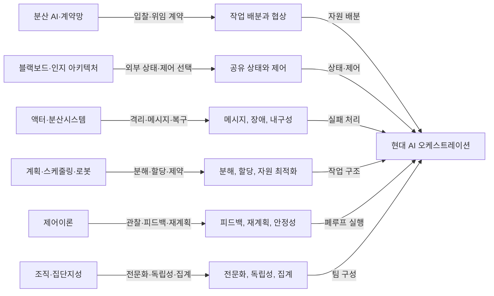

# AI 오케스트레이션: 폭넓은 문헌조사와 분야 간 종합

> 조사 기준일: 2026-08-03
>
> 문서 성격: 이론·실증·표준·인접 분야를 함께 읽는 연구 노트
>
> 관련 문서: [AI 오케스트레이션 실용 사례와 구축 방법론](./ai-orchestration-practical-cases-and-methods.md)
>
> 범위 메모: 이 문서는 **간단한 오케스트라의 권장 최소 구조**를 제안하지 않는다. 실제 사례와 구현법은 위 관련 문서에 분리해 두고, 여기서는 넓은 문헌 지형과 그로부터 얻을 수 있는 설계 원리를 다룬다.

## 목차

- [초록](#초록)
- [1. 조사 질문과 방법](#1-조사-질문과-방법)
  - [1.3 근거 수준 표시](#13-근거-수준-표시)
- [2. AI 오케스트레이션의 작동 정의](#2-ai-오케스트레이션의-작동-정의)
  - [2.1 하나의 표준 정의는 아직 없다](#21-하나의-표준-정의는-아직-없다)
- [3. 역사적 계보](#3-역사적-계보-최신-에이전트-이전에-이미-존재했던-문제)
  - [3.2 Blackboard](#32-blackboard-공유-작업-공간과-무엇을-다음에-할지의-분리)
- [4. 현대 LLM 에이전트의 핵심 메커니즘](#4-현대-llm-에이전트의-핵심-메커니즘)
  - [4.9 모델 라우팅과 캐스케이드](#49-모델-라우팅과-캐스케이드-모든-요청에-같은-모델을-쓰지-않는다)
- [5. 통신 토폴로지](#5-통신-토폴로지-몇-명인가보다-누가-누구와-말하는가)
  - [5.2 최근 실증 결과](#52-최근-실증-결과)
- [6. 분산시스템에서 가져올 것](#6-분산시스템에서-가져올-것)
  - [6.7 합의와 수렴](#67-합의와-수렴-대화의-일치와-분산-상태의-일관성은-다르다)
- [7. 계획·제어·로봇공학에서 가져올 것](#7-계획제어로봇공학에서-가져올-것)
  - [7.2 모델예측제어](#72-모델예측제어-전체-미래를-믿지-말고-짧게-계획하고-다시-관찰하기)
- [8. 조직과학과 집단지성에서 가져올 것](#8-조직과학과-집단지성에서-가져올-것)
  - [8.4 상관 오류](#84-상관-오류-같은-모델을-여러-번-부르면-독립-전문가가-되는가)
- [9. 실증 문헌](#9-실증-문헌-언제-다중-에이전트가-작동하고-언제-무너지는가)
  - [9.0 다중 에이전트가 유리하다고 보고된 근거](#90-다중-에이전트가-유리하다고-보고된-근거)
- [10. 실패를 설명하는 공통 메커니즘](#10-실패를-설명하는-공통-메커니즘)
- [11. 보안·권한·안전 문헌](#11-보안권한안전-문헌)
  - [11.3 사람 개입은 실패가 아니라 제어 모드다](#113-사람-개입은-실패가-아니라-제어-모드다)
- [12. 상호운용과 관측 가능성의 최신 흐름](#12-상호운용과-관측-가능성의-최신-흐름)
- [13. 분야 간 문헌에서 도출되는 설계 법칙](#13-분야-간-문헌에서-도출되는-설계-법칙)
- [14. 연구·평가 프레임](#14-연구평가-프레임)
  - [14.7 논문·사례를 읽을 때의 점검 질문](#147-논문사례를-읽을-때의-점검-질문)
- [15. 남아 있는 연구 공백](#15-남아-있는-연구-공백)
- [16. 분야별 주석 문헌 지도](#16-분야별-주석-문헌-지도)
- [17. 최종 종합](#17-최종-종합)

---

## 초록

AI 오케스트레이션은 단순히 여러 LLM을 한 줄로 연결하는 기술이 아니다. 더 일반적으로는 **불완전하고 비용이 들며 때로는 실패하는 행위자·도구·모델을, 상태와 제약 아래에서 목표 달성 쪽으로 조정하는 문제**다. 이 문제는 최신 LLM 에이전트 연구에서 갑자기 생겨난 것이 아니라 다음 계보가 합류한 결과다.

- 분산 AI의 계약망(Contract Net), 블랙보드, BDI 에이전트
- 액터 모델, 이벤트 소싱, Saga, 내구성 워크플로 같은 분산시스템
- HTN 계획, 스케줄링, 시장 기반 작업 할당 같은 운영연구·로봇공학
- 모델예측제어(MPC), 피드백 제어, 상태 추정 같은 제어이론
- 트랜잭티브 메모리, 지휘 범위, 팀 인지 같은 조직과학
- 다양성·독립성·집계 조건을 연구한 집단지성 문헌
- ReAct, Reflexion, Tree of Thoughts, AutoGen, MetaGPT, Mixture-of-Agents 같은 LLM 에이전트 연구
- MCP, A2A, OpenTelemetry, NIST의 에이전트 상호운용·보안 표준화

문헌을 종합하면 핵심 결론은 다음과 같다.

1. **에이전트 수보다 정보 구조가 중요하다.** 누가 무엇을 알고, 무엇을 누구에게 언제 전달하는지가 성능을 좌우한다.
2. **병렬화는 분해 가능한 작업에서만 이득이다.** 순차 의존성이 강한 작업은 조정 비용과 오류 증폭 때문에 다중 에이전트가 오히려 나빠질 수 있다.
3. **자율성보다 폐루프 제어가 중요하다.** 계획을 한 번 만들고 실행하는 개루프 방식보다 관찰·검증·재계획이 반복되는 구조가 현실의 불확실성에 강하다.
4. **자연어 대화는 상태 저장소가 아니다.** 작업 상태, 증거, 권한, 비용, 산출물 계보는 구조화된 외부 상태로 남겨야 한다.
5. **다수결은 독립된 오류일 때만 강하다.** 같은 모델·프롬프트·검색 결과를 공유한 에이전트들은 강하게 상관된 오류를 내므로 머릿수만 늘려도 유효 표본 수가 거의 늘지 않을 수 있다.
6. **실패는 예외가 아니라 정상 경로다.** 재시도, 멱등성, 보상, 체크포인트, 중단, 사람에게 이관하는 동작이 본체의 일부여야 한다.
7. **오케스트레이터는 ‘가장 똑똑한 에이전트’가 아니라 제약 집행자여야 한다.** 예산, 권한, 종료 조건, 증거 규칙, 관측 가능성을 결정론적으로 관리하는 편이 신뢰성이 높다.
8. **평가는 최종 정답 하나로 끝나지 않는다.** 성공률, 비용, 지연, 재현성, 정책 준수, 사람 개입률, 복구 가능성을 함께 봐야 한다.

---

## 1. 조사 질문과 방법

### 1.1 조사 질문

이 문헌조사는 네 가지 질문을 중심으로 구성했다.

1. AI 오케스트레이션이라는 문제는 과거 어떤 학문적 문제의 후손인가?
2. 최신 LLM 에이전트 연구는 계획·기억·도구·협업을 어떤 메커니즘으로 구현하는가?
3. 다중 에이전트가 실제로 유리하거나 불리해지는 조건에 관한 실증 근거는 무엇인가?
4. 분산시스템, 제어이론, 로봇공학, 조직과학, 집단지성, 안전공학에서 가져올 수 있는 설계 규칙은 무엇인가?

### 1.2 검색 범위

문헌 범위를 ‘LLM multi-agent’ 키워드에 한정하지 않았다. 다음 분야의 1차 논문, 표준 문서, 공공기관 자료, 공식 기술 보고서를 함께 검토했다.

- 고전 분산 인공지능 및 인지 아키텍처
- LLM 기반 단일·다중 에이전트
- 워크플로·분산시스템·서버리스 실행
- 자동계획·스케줄링·다중 로봇 작업 할당
- 제어이론과 자율 시스템
- 조직과학·팀 인지·사고 지휘 체계
- 집단지성·정보 확산·상관 오류
- 에이전트 평가·관측 가능성·보안·상호운용 표준

### 1.3 근거 수준 표시

이 분야는 산업 블로그와 사전출판물이 많으므로, 본문에서는 근거를 다음처럼 구분한다.

| 수준 | 의미 | 해석 방법 |
|---|---|---|
| A | 동료평가 논문, 공식 표준, 공공기관 자료 | 비교적 강한 근거지만 적용 범위는 확인해야 함 |
| B | 대규모 실험을 포함한 사전출판물, 학회 발표 전 논문 | 유용하나 후속 검증과 재현을 기다려야 함 |
| C | 기업의 공식 사례·엔지니어링 보고서 | 실제 운영 맥락은 강하지만 선택 편향과 재현성 한계가 있음 |
| D | 프레임워크 문서·개념 제안 | 설계 어휘와 구현 힌트로 사용하되 효과를 전제하지 않음 |

성과 수치는 원 논문의 모델·시점·벤치마크 안에서만 해석했다. 서로 다른 데이터셋의 숫자를 직접 비교하지 않았다.

---

## 2. ‘AI 오케스트레이션’의 작동 정의

### 2.1 하나의 표준 정의는 아직 없다

‘오케스트레이션’은 산업 문맥에 따라 다음처럼 서로 다른 층을 가리킨다.

| 층 | 핵심 결정 | 대표 질문 |
|---|---|---|
| 모델 오케스트레이션 | 모델 선택·앙상블·라우팅 | 이 요청에 어느 모델을 쓸 것인가? |
| 추론 오케스트레이션 | 탐색·비평·재시도 | 한 번 답할까, 여러 경로를 탐색할까? |
| 도구 오케스트레이션 | 도구 발견·호출·권한 | 어떤 API를 어떤 인자로 호출할 것인가? |
| 워크플로 오케스트레이션 | 작업 분해·의존성·복구 | 어떤 순서와 병렬성으로 실행할 것인가? |
| 다중 에이전트 조정 | 역할·통신·합의·위임 | 누가 무엇을 맡고 어떻게 결과를 합칠 것인가? |
| 자원 오케스트레이션 | 비용·지연·GPU·쿼터 | 제한된 자원을 어디에 배분할 것인가? |
| 거버넌스 오케스트레이션 | 정책·감사·사람 승인 | 무엇을 자동화해도 되고 어디서 멈춰야 하는가? |

이 문서에서 AI 오케스트레이션은 다음과 같이 정의한다.

> **AI 오케스트레이션은 복수의 확률적·결정론적 구성요소가 공유 목표를 달성하도록 작업, 상태, 정보, 권한, 자원, 피드백을 배치하고 조정하는 폐루프 실행 체계다.**

이 정의의 중요한 점은 ‘에이전트가 여러 개’라는 조건이 없다는 것이다. 단일 에이전트라도 여러 도구·검증기·상태 전이를 조정한다면 오케스트레이션이고, 여러 에이전트가 자유 대화만 한다면 견고한 오케스트레이션이 아닐 수 있다.

### 2.2 오케스트레이션과 에이전트의 구분

- **에이전트**는 관찰을 받아 다음 행동을 선택하는 행위자다.
- **워크플로**는 미리 정의된 제어 흐름이다.
- **오케스트레이터**는 흐름, 상태, 자원, 실패, 권한을 조정한다.
- **프로토콜**은 구성요소 사이 메시지 의미와 교환 규칙을 정한다.
- **거버넌스**는 허용 가능한 행동과 책임 경계를 정한다.

LLM을 사용한다고 모두 에이전트가 되는 것도 아니고, 에이전트를 사용한다고 오케스트레이터가 생기는 것도 아니다. 이 구분을 하지 않으면 프롬프트 속 역할극을 시스템 수준의 책임 분리로 오인하기 쉽다.

---

## 3. 역사적 계보: 최신 에이전트 이전에 이미 존재했던 문제

### 3.1 Contract Net: 중앙 명령이 아니라 공고·입찰·수여

Reid G. Smith의 1980년 논문은 느슨하게 결합된 비동기 노드들이 공유 메모리 없이 작업을 협상으로 배분하는 **Contract Net Protocol**을 제안했다. 관리 노드는 작업을 공고하고, 잠재 수행자는 자신의 능력·부하를 바탕으로 입찰하며, 관리자는 계약을 수여한다.

오늘의 에이전트 오케스트레이션에 주는 의미는 명확하다.

- 고정 역할명보다 **능력 설명과 현재 가용성**이 중요하다.
- 중앙 오케스트레이터가 모든 실행 세부사항을 알 필요는 없다.
- 동적 환경에서는 정적 라우팅보다 입찰·비용 추정·재할당이 적합할 수 있다.
- 통신 프로토콜은 메시지 형식뿐 아니라 공고, 입찰, 수여, 완료라는 **대화의 상태 전이**를 정의해야 한다.

출처: [Smith, *The Contract Net Protocol: High-Level Communication and Control in a Distributed Problem Solver* (IEEE Transactions on Computers 29(12), 1980)](https://ieeexplore.ieee.org/document/1675516) — 근거 A.

### 3.2 Blackboard: 공유 작업 공간과 ‘무엇을 다음에 할지’의 분리

블랙보드 아키텍처의 계보는 Hearsay-II 음성이해 시스템으로 거슬러 올라간다. Erman, Frederick Hayes-Roth, Lesser, Reddy는 여러 지식원이 공통 블랙보드에 부분 해를 남기며 불확실성을 해소하는 구조를 정리했다. Barbara Hayes-Roth의 1985년 논문은 이 계보 위에서 **제어 결정 자체를 별도의 제어 블랙보드에서 다루는 구조**를 제안했다. 핵심 문제는 지식의 보유보다 **가능한 행동 가운데 어느 것을 언제 수행할 것인가**다.

현대 시스템으로 옮기면 다음 대응이 자연스럽다.

| 블랙보드 개념 | 현대 오케스트레이션 대응 |
|---|---|
| 공유 블랙보드 | 구조화된 작업 상태, 증거 저장소, 산출물 레지스트리 |
| 지식원 | 전문 에이전트, 도구, 검증기, 검색기 |
| 제어 셸 | 스케줄러, 라우터, 정책 엔진 |
| 부분 해 | 중간 산출물, 가설, 테스트 결과 |

가장 중요한 교훈은 에이전트 간 대화 로그와 공유 상태를 구분하는 것이다. 대화는 상호작용 수단이고, 블랙보드는 재개·감사·충돌 해결이 가능한 시스템 기록이다.

출처:

- [Erman, Hayes-Roth, Lesser & Reddy, *The Hearsay-II Speech-Understanding System: Integrating Knowledge to Resolve Uncertainty* (ACM Computing Surveys 12(2), 1980)](https://doi.org/10.1145/356810.356816) — 근거 A.
- [Barbara Hayes-Roth, *A Blackboard Architecture for Control* (Artificial Intelligence, 1985)](https://www.sciencedirect.com/science/article/pii/0004370285900633) — 근거 A.

### 3.3 Actor Model: 공유 메모리 대신 메시지와 격리

액터 모델은 독립된 행위자가 메시지를 받고, 로컬 상태를 바꾸고, 새 액터를 만들고, 다른 액터에게 메시지를 보내는 계산 관점을 제공했다. 순서·지연·실패가 존재하는 분산 환경에서 공유 가변 상태를 최소화한다.

LLM 에이전트 시스템에 적용할 때의 요점은 다음과 같다.

- 각 에이전트의 작업 상태와 권한 범위를 격리한다.
- 메시지는 암묵적 대화가 아니라 스키마와 상관관계 ID를 갖는 사건으로 다룬다.
- ‘정확히 한 번’ 실행을 가정하지 말고 중복·재전달에 견디게 한다.
- 에이전트가 죽어도 전체 작업을 복구할 수 있도록 상태를 외부에 내구성 있게 남긴다.

출처: [Hewitt, *Viewing Control Structures as Patterns of Passing Messages* (Artificial Intelligence, 1977)](https://www.sciencedirect.com/science/article/pii/0004370277900339) — 근거 A.

### 3.4 BDI: 믿음·목표·의도를 분리한 지속적 행위

BDI(Belief–Desire–Intention) 아키텍처는 행위자의 정보 상태, 달성하고 싶은 상태, 현재 헌신한 계획을 구분한다. Rao와 Georgeff는 이 이론을 실제 에이전트 시스템과 연결했고 항공교통 관리 사례도 논의했다.

이 구분은 LLM 프롬프트에도 유용하지만, 더 중요한 것은 런타임 상태로 외재화하는 것이다.

- **Belief**: 관찰된 사실, 출처, 신뢰도, 마지막 갱신 시각
- **Desire**: 목표와 성공 조건, 우선순위
- **Intention**: 현재 채택한 계획과 취소·변경 조건

목표, 사실, 계획을 하나의 자연어 컨텍스트에 섞으면 오래된 관찰을 사실로 유지하거나, 폐기한 계획을 계속 실행하거나, 목표와 수단을 혼동하기 쉽다.

출처: [Rao & Georgeff, *BDI Agents: From Theory to Practice* (ICMAS, 1995)](https://aaai.org/papers/icmas95-042-bdi-agents-from-theory-to-practice/) — 근거 A.

### 3.5 Subsumption: 세계 모델이 완전할 때까지 기다리지 않는 반응 계층

Brooks의 1986년 *A Robust Layered Control System for a Mobile Robot*은 행동 계층을 증분적으로 쌓고 상위 계층이 하위 계층을 억제할 수 있는 subsumption 아키텍처를 제시했다. 1991년 *Intelligence without Representation*은 하나의 거대한 중앙 표현보다 환경과 직접 연결된 병렬 행동 계층이라는 문제의식을 확장했다.

**설계적 유추:** AI 오케스트레이션에서 저수준 정책 게이트를 로봇의 반응 계층과 동일시할 수는 없지만, 고수준 계획과 독립적으로 강제되는 층을 둔다는 원리는 옮길 수 있다. 데이터 유출 방지, 예산 상한, 파괴적 동작 승인, 타임아웃은 고수준 에이전트의 판단보다 아래에서 적용되어야 한다.

출처:

- [Brooks, *A Robust Layered Control System for a Mobile Robot* (IEEE Journal of Robotics and Automation, 1986)](https://doi.org/10.1109/JRA.1986.1087032) — 근거 A.
- [Brooks, *Intelligence without Representation* (Artificial Intelligence, 1991)](https://www.sciencedirect.com/science/article/pii/000437029190053M) — 근거 A.

### 3.6 CoALA와 인지 아키텍처의 귀환

CoALA는 언어 에이전트를 모듈형 기억, 구조화된 행동 공간, 일반화된 의사결정 과정으로 설명한다. 2026년의 메커니즘 수준 리뷰는 고전 인지 아키텍처와 현대 언어 에이전트를 상태, 제어, 전이, 지속성, 실패, 학습, 자원 거버넌스라는 공통 축으로 비교한다.

이는 ‘에이전트 = LLM + 프롬프트’라는 관점이 부족함을 보여준다. 지속적 시스템에는 적어도 기억의 종류, 행동 인터페이스, 제어 루프, 실패 처리, 자원 경계가 필요하다.

출처:

- [Sumers et al., *Cognitive Architectures for Language Agents* (TMLR, 2024)](https://openreview.net/forum?id=1i6ZCvflQJ) — 근거 A.
- [Fan & Lan, *From Cognitive Architectures to Language Agents: A Mechanism-Level Review of Lineage, Convergence, and Migration Gaps* (arXiv:2607.23942, 2026)](https://arxiv.org/abs/2607.23942) — 매우 최신 사전출판물, 근거 B.

---

## 4. 현대 LLM 에이전트의 핵심 메커니즘

### 4.1 추론과 행동을 번갈아 수행하기: ReAct

ReAct는 추론 흔적과 환경 행동을 교차시킨다. 핵심은 모든 계획을 먼저 완성한 뒤 실행하는 것이 아니라, 행동 결과를 다음 판단에 다시 넣는 것이다. 오케스트레이션 관점에서는 가장 단순한 폐루프다.

출처: [Yao et al., *ReAct: Synergizing Reasoning and Acting in Language Models* (ICLR, 2023)](https://openreview.net/forum?id=WE_vluYUL-X) — 근거 A.

### 4.2 도구 사용을 정책으로 학습하기: Toolformer

Toolformer는 어떤 API를 언제, 어떤 인자로 호출하고 결과를 이후 예측에 어떻게 통합할지를 모델이 학습하도록 했다. 오늘날의 도구 호출 프레임워크와 동일하지는 않지만, 도구 선택 자체가 별도의 정책 문제임을 분명히 했다.

오케스트레이터는 도구 목록을 노출하는 것에서 끝나지 않고 다음을 관리해야 한다.

- 호출 전제조건과 권한
- 인자 검증과 출력 스키마
- 비용·지연·실패율
- 부작용 여부와 멱등성
- 결과의 신선도와 출처

출처: [Schick et al., *Toolformer: Language Models Can Teach Themselves to Use Tools* (NeurIPS, 2023)](https://proceedings.neurips.cc/paper_files/paper/2023/hash/d842425e4bf79ba039352da0f658a906-Abstract-Conference.html) — 근거 A.

### 4.3 탐색 공간을 명시하기: Tree of Thoughts

Tree of Thoughts는 여러 중간 사고 경로를 생성하고 평가하며 탐색·백트래킹한다. 중요한 일반화는 ‘더 길게 생각하기’가 아니라 **후보 생성, 상태 평가, 탐색 정책, 중단 기준을 분리**하는 것이다.

실제 오케스트레이션에서는 다음 형태로 옮길 수 있다.

- 하나의 계획을 고집하지 않고 제한된 수의 후보 계획 생성
- 후보마다 비용·위험·근거 충족도를 계산
- 검증 실패 시 분기점으로 되돌아감
- 탐색 예산을 명시해 무한 자기반성을 방지

출처: [Yao et al., *Tree of Thoughts: Deliberate Problem Solving with Large Language Models* (NeurIPS, 2023)](https://proceedings.neurips.cc/paper_files/paper/2023/hash/271db9922b8d1f4dd7aaef84ed5ac703-Abstract-Conference.html) — 근거 A.

### 4.4 언어 피드백을 기억으로 만들기: Reflexion

Reflexion은 가중치 업데이트 대신 수행 피드백을 언어로 반성하고 이를 에피소드 기억에 보존한다. 설계상 핵심은 ‘자기비평’ 자체보다 **외부 피드백 → 요약된 교훈 → 다음 시도에 선택적으로 재사용**하는 경로다.

주의할 점도 있다. 검증되지 않은 자기평가를 계속 저장하면 오판이 장기 기억으로 굳어진다. 반성 메모에는 발생 조건, 근거, 만료·폐기 조건, 적용 범위를 붙여야 한다. MemGPT는 운영체제의 계층형 메모리에서 착안해 제한된 컨텍스트와 외부 기억 사이의 이동을 관리하지만, 무엇을 장기 보존해야 참인지와 오염을 어떻게 제거할지는 별도 문제로 남는다(15.2절).

출처:

- [Shinn et al., *Reflexion: Language Agents with Verbal Reinforcement Learning* (NeurIPS, 2023)](https://proceedings.neurips.cc/paper_files/paper/2023/hash/1b44b878bb782e6954cd888628510e90-Abstract-Conference.html) — 근거 A.
- [Packer et al., *MemGPT: Towards LLMs as Operating Systems* (arXiv:2310.08560, 2023; rev. 2024)](https://arxiv.org/abs/2310.08560) — 사전출판물, 근거 B.

### 4.5 대화 가능한 다중 에이전트: AutoGen

AutoGen은 LLM, 사람, 도구를 사용하는 여러 대화형 에이전트로 애플리케이션을 구성하는 일반 프레임워크를 제시했다. 이 연구가 확산시킨 중요한 아이디어는 행위자마다 모델·도구·사람 개입 방식을 다르게 구성할 수 있다는 점이다.

그러나 ‘대화 가능’은 ‘조정 가능’과 같지 않다. 생산 시스템에는 3.2절에서 구분한 공유 시스템 기록과 함께 종료 조건, 메시지 계약, 권한, 재시도 정책이 필요하다.

출처: [Wu et al., *AutoGen: Enabling Next-Gen LLM Applications via Multi-Agent Conversation* (COLM, 2024)](https://openreview.net/forum?id=BAakY1hNKS) — 근거 A.

### 4.6 역할과 산출물 계약: MetaGPT·ChatDev

MetaGPT와 ChatDev는 소프트웨어 조직의 역할, 절차, 중간 산출물을 에이전트 협업에 투영했다. 여기서 재사용할 핵심은 사람 직함을 흉내 내는 것이 아니라 **산출물 사이 계약을 명시하는 것**이다.

- 요구사항 문서가 어떤 필드를 보장해야 설계 단계가 시작되는가?
- 코드 단계가 테스트 단계에 무엇을 전달해야 하는가?
- 리뷰 결과는 승인, 수정 요청, 차단 중 어느 상태인가?

출처:

- [Hong et al., *MetaGPT: Meta Programming for A Multi-Agent Collaborative Framework* (ICLR, 2024)](https://proceedings.iclr.cc/paper_files/paper/2024/file/6507b115562bb0a305f1958ccc87355a-Paper-Conference.pdf) — 근거 A.
- [Qian et al., *ChatDev: Communicative Agents for Software Development* (ACL, 2024)](https://aclanthology.org/2024.acl-long.810/) — 근거 A.

> 운영 사례와 산출물 상세는 [실용 사례와 구축 방법론](./ai-orchestration-practical-cases-and-methods.md) §5.1 MetaGPT, §5.2 ChatDev 참조.

### 4.7 다수 모델의 계층적 집계: Mixture-of-Agents

Mixture-of-Agents는 한 층의 여러 모델 출력을 다음 층 에이전트들이 참고하는 계층형 집계를 제안했다. 이는 서로 다른 모델의 강점을 결합할 가능성을 보여주지만, 모든 단계가 이전 출력을 공유하면 비용과 상관 오류도 함께 증가한다.

따라서 적용 전에 다음 질문이 필요하다.

- 구성원들이 실제로 다른 정보·모델·도구를 사용하는가?
- 집계기는 인기 있는 표현을 선택하는가, 근거가 강한 답을 선택하는가?
- 추가 호출이 주는 정확도 향상이 비용·지연을 정당화하는가?

출처: [Wang et al., *Mixture-of-Agents Enhances Large Language Model Capabilities* (ICLR, 2025)](https://openreview.net/forum?id=h0ZfDIrj7T) — 근거 A.

### 4.8 범용 관리자와 전문 작업자: Magentic-One

Magentic-One은 관리자 역할의 Orchestrator와 브라우저·파일·코드 등 전문 에이전트를 결합했다. 범용 작업에서 관리자-전문가 패턴의 실용성을 보여주지만, 하나의 관리자에게 계획·기억·오류 복구가 몰리면 중앙 병목과 단일 실패점이 된다.

출처: [Microsoft Research, *Magentic-One: A Generalist Multi-Agent System for Solving Complex Tasks* (Microsoft Research Technical Article, 2024)](https://www.microsoft.com/en-us/research/articles/magentic-one-a-generalist-multi-agent-system-for-solving-complex-tasks/) — 근거 C.

> 운영 구성과 평가 상세는 [실용 사례와 구축 방법론](./ai-orchestration-practical-cases-and-methods.md) §6.1 참조.

### 4.9 모델 라우팅과 캐스케이드: 모든 요청에 같은 모델을 쓰지 않는다

모델 오케스트레이션은 요청 난이도와 품질·비용 목표에 따라 모델 또는 호출 순서를 선택한다. FrugalGPT는 서로 다른 LLM API를 캐스케이드로 조합해 평가한 과제에서 품질을 유지하며 큰 비용 절감이 가능함을 보였고, RouteLLM은 강한 모델과 약한 모델 사이의 학습 라우팅으로 평가한 벤치마크에서 품질 손실 없이 비용을 2배 이상 줄였다고 보고했다. 수치는 각 가격표와 과제에 종속되지만, 법칙 10의 ‘관측 실적 기반 배정’과 법칙 12의 다목적 최적화를 직접 뒷받침한다.

출처:

- [Chen, Zaharia & Zou, *FrugalGPT: How to Use Large Language Models While Reducing Cost and Improving Performance* (TMLR, 2024)](https://openreview.net/forum?id=cSimKw5p6R) — 근거 A.
- [Ong et al., *RouteLLM: Learning to Route LLMs from Preference Data* (ICLR, 2025)](https://proceedings.iclr.cc/paper_files/paper/2025/hash/5503a7c69d48a2f86fc00b3dc09de686-Abstract-Conference.html) — 근거 A.

---

## 5. 통신 토폴로지: 몇 명인가보다 누가 누구와 말하는가

다중 에이전트 연구는 초기에 역할 프롬프트와 대화 프로토콜에 집중했지만, 최근에는 통신 그래프 자체가 중요한 독립 변수로 다뤄진다.

### 5.1 대표 토폴로지

이 표는 고전 아키텍처와 최근 통신 그래프 연구를 묶은 **저자의 종합**이다. ‘맞는 상황’은 비교 실험으로 모두 확정된 처방이 아니라 설계 가설이며, 근거 열에 직접 지지 범위를 구분했다.

| 토폴로지 | 장점 | 주요 실패 방식 | 맞는 상황 | 대표 근거 |
|---|---|---|---|---|
| 중앙집중형 | 상태 통합, 정책 집행, 디버깅이 쉬움 | 병목, 단일 실패점, 관리자 컨텍스트 과부하 | 작업 수가 작고 통제가 중요한 경우 | Google 확장 논문, Magentic-One |
| 완전연결형 | 정보 도달이 빠름 | 메시지 폭증, 동조, 오류 전파 | 소수 에이전트의 짧은 숙의 | EMNLP 2025 토폴로지 연구 |
| 계층형 | 역할·책임 경계가 선명 | 상위 요약에서 정보 손실 | 큰 작업의 단계적 분해 | HTN·MetaGPT에서의 설계적 유추 |
| 파이프라인 | 산출물 계약이 명확 | 초기 오류가 하류로 전파 | 순차 변환 작업 | ChatDev·Saga에서의 설계적 유추 |
| 스타/허브형 | 집계가 단순 | 허브 편향과 병목 | 독립 조사 후 단일 집계 | Mixture-of-Agents, Google 확장 논문 |
| 희소 그래프 | 오류 전파 억제, 비용 감소 | 필요한 정보가 늦게 도달 | 독립성이 중요한 대규모 협업 | EMNLP 2025 토폴로지 연구 |
| 공유 블랙보드 | 비동기 협업과 상태 복구 | 상태 충돌, 쓰기 규칙 필요 | 긴 작업과 다양한 전문 도구 | Hearsay-II, MAS-BENCH/CAMOC |
| 동적 그래프 | 작업에 따라 효율 조절 | 라우팅 정책 자체가 복잡 | 작업 유형 변동이 큰 경우 | AMAS; 장기 우위는 미확립 |

### 5.2 최근 실증 결과

**SILO-BENCH**는 원문 실험표에 명시된 여섯 규모 `N={2, 5, 10, 20, 50, 100}`에서, 최대 100개 에이전트까지 분산 조정을 평가했다. 54개 구성, 1,620개 실험에서 에이전트들은 활발히 메시지를 주고받아도 분산 계산을 성공적으로 수행하지 못했으며, 가장 어려운 Level-III 과제는 50개를 넘는 구성에서 성공률이 0이었다. 이는 ‘소통량’과 ‘조정 능력’이 다르다는 근거다.

출처: [Zhang et al., *SILO-BENCH: A Scalable Environment for Evaluating Distributed Coordination in Multi-Agent LLM Systems* (ACL 2026 Long Papers)](https://aclanthology.org/2026.acl-long.1354/) — 근거 A.

**MAS-BENCH**는 20개 에이전트가 정렬 같은 명확한 분산 과제에서도 공유 상태 유지, 규약 합의, 일관된 종료에 실패할 수 있음을 보였다. 다만 이 연구는 협업 인지형 정보 공유, 조기 전역 메타데이터 교환, 단일 커밋 검증을 결합한 경량 완화책 **CAMOC**도 제시했고, 여러 백엔드에서 조정 성공률과 효율이 개선되며 공유 상태 상호작용에서 이득이 가장 컸다고 보고했다.

출처: [Yang et al., *When 20 Agents Fail to Sort: The Distributed Sorting Benchmark for Scalable Multi-Agent Systems* (Findings of ACL, 2026)](https://aclanthology.org/2026.findings-acl.1698/) — 근거 A.

두 벤치마크는 Xin Yang, Xuxin Cheng, Cao Liu, Ke Zeng, Wenyuan Jiang 등 저자가 겹치고 정렬·집계처럼 정확한 정답이 존재하는 알고리즘 과제를 다루므로, 서로 독립된 재현이나 실제 지식노동 전체의 증거로 볼 수 없다. 반면 다른 연구진의 MacNet 실험은 1,000개 이상 에이전트의 추론 과제에서 규모 이득을 보고해 결과가 과제와 구조에 달림을 보여준다(9.0절).

통신 토폴로지 연구에서는 **중간 정도로 희소한 그래프**가 유용한 정보 확산은 유지하면서 오류 전파를 억제해 종종 가장 좋은 성능을 냈다. 완전연결이 항상 최선이 아니라는 뜻이다.

출처: [Shen et al., *Understanding the Information Propagation Effects of Communication Topologies in LLM-based Multi-Agent Systems* (EMNLP, 2025)](https://aclanthology.org/2025.emnlp-main.623/) — 근거 A.

AMAS는 작업마다 적합한 통신 그래프를 선택하는 동적 접근을 제안했다. 고정 토폴로지가 모든 문제에 최적이라는 가정을 버려야 한다.

출처: [Leong et al., *AMAS: Adaptively Determining Communication Topology for LLM-based Multi-agent System* (EMNLP 2025 Industry Track)](https://aclanthology.org/2025.emnlp-industry.144/) — 근거 A.

대화가 협력을 늘리더라도 과업 성공을 보장하지는 않는다. Stag Hunt 실험에서는 한 단어 통신만으로 협력이 0%에서 48.3%로 늘었지만, 체화된 다중 에이전트 연구에서는 대화가 행동 충돌을 크게 줄이는 동시에 전체 성공률을 떨어뜨리기도 했다. 표면적 합의와 환경에 대한 정렬된 세계 모델은 다르다.

출처:

- [*Communication Enables Cooperation in LLM Agents* (EACL, 2026)](https://aclanthology.org/2026.eacl-short.23/) — 근거 A.
- [*Embodied Multi-Agent Coordination by Aligning World Models Through Dialogue* (SIGDIAL, 2026)](https://aclanthology.org/2026.sigdial-1.21/) — 근거 A.

### 5.3 토폴로지도 보안 자산이다

CIA 연구는 블랙박스 접근 권한을 가진 공격자가 중간 에이전트의 추론 출력을 유도하는 적대적 질의를 능동 주입하면 통신 토폴로지를 평균 AUC 0.87, 최고 0.99 수준으로 추론할 수 있다고 보고했다. 평가는 G-Designer 계열로 최적화된 토폴로지에 한정되므로 모든 시스템에 수치를 일반화할 수는 없다. 질의율 제한과 중간 출력 노출 통제가 필요한 이유이며, 역할 관계와 통신 패턴은 지식재산이자 공격 표면일 수 있다.

출처: [Wu et al., *CIA: Inferring the Communication Topology from LLM-based Multi-Agent Systems* (ACL, 2026)](https://aclanthology.org/2026.acl-long.815/) — 근거 A.

---

## 6. 분산시스템에서 가져올 것

### 6.1 이벤트 소싱: 현재 상태뿐 아니라 어떻게 여기 왔는가

이벤트 소싱은 상태 변경을 사건의 연속으로 저장하고 현재 상태를 재구성한다. AI 작업에서는 프롬프트와 최종 답만 보존하는 대신 다음을 사건으로 남기는 방식이다.

- 작업 생성·분해·할당
- 도구 호출과 결과
- 정책 승인·거부
- 모델·프롬프트·도구 버전
- 검증 결과와 재시도 이유
- 비용·토큰·지연
- 사람 개입과 수정

이 기록은 **감사, 인과 추적, 장애 분석, 부분 재실행**의 기반이 된다. 사건 재생이 동일 결과를 보장하는 것은 결정론적 상태 전이일 때뿐이다. 확률적 모델과 시점 의존 도구가 포함되면 seed·모델 버전·프롬프트와 도구 응답 스냅샷까지 고정해야 제한적 재현을 논할 수 있고, 그래도 반복 일관성은 14.1절의 `pass^k`처럼 별도로 측정해야 한다. 민감한 프롬프트와 도구 인자를 무조건 기록하면 보안·개인정보 문제가 생기므로 선택적 캡처와 보존 정책도 필요하다.

출처: [Martin Fowler, *Event Sourcing*](https://www.martinfowler.com/eaaDev/EventSourcing.html) — 근거 D.

### 6.2 내구성 실행: 프로세스가 아니라 작업이 살아남아야 한다

내구성 워크플로의 핵심은 서버 프로세스가 재시작되어도 작업 상태를 복구하고, 타이머·재시도·외부 응답 대기를 이어 가는 것이다. 긴 AI 작업은 모델 오류보다 네트워크, 브라우저, API 제한, 사람 승인 대기 때문에 더 자주 중단될 수 있다.

출처: [Temporal, *Durable Execution*](https://temporal.io/) — 공식 구현 문서, 근거 D.

> 구현 선택과 운영 상세는 [실용 사례와 구축 방법론](./ai-orchestration-practical-cases-and-methods.md) §10 참조.

### 6.3 Saga: 되돌릴 수 없는 세계에서의 보상

데이터베이스의 Saga는 긴 트랜잭션을 작은 트랜잭션으로 나누고, 중간 실패 시 이미 완료된 단계에 대응하는 보상 동작을 수행한다. 에이전트가 이메일 발송, 주문, 티켓 생성처럼 외부 부작용을 일으킨다면 전체를 원자적으로 롤백할 수 없다.

따라서 각 부작용 도구에는 다음이 필요하다.

- 사전 검증과 승인
- 멱등성 키
- 완료 영수증
- 가능한 보상 동작
- 보상이 불가능할 때 사람에게 이관하는 절차

출처: [Garcia-Molina & Salem, *Sagas* (SIGMOD, 1987)](https://sigmodrecord.org/publications/sigmodRecord/8712/pdfs/38714.38742.pdf) — 근거 A.

### 6.4 Reconciliation Loop: 명령보다 원하는 상태

Kubernetes 컨트롤러는 현재 상태를 관찰하고 원하는 상태와의 차이를 줄이는 동작을 반복한다. AI 오케스트레이션도 ‘이 명령들을 그대로 실행하라’보다 다음과 같은 선언적 목표를 둘 수 있다.

- 필요한 산출물 목록과 검증 조건
- 완료되어야 할 의존성
- 허용 비용·시간·권한
- 현재 실패와 재시도 가능 여부

이 접근은 환경 변화와 부분 실패에 강하지만, 목표 상태가 모호하거나 평가기가 부정확하면 잘못된 상태로 수렴할 수 있다.

출처: [Kubernetes, *Controllers*](https://kubernetes.io/docs/concepts/architecture/controller/) — 공식 구현 문서, 근거 D.

> 운영 사례 상세는 [실용 사례와 구축 방법론](./ai-orchestration-practical-cases-and-methods.md) §8.2 참조.

### 6.5 오케스트레이터 없는 오케스트레이션

서버리스 연구 Unum은 중앙 오케스트레이터를 데이터 경로에서 제거하고 함수 사이 트리거와 상태를 분산해 대표 애플리케이션에서 더 낮은 지연과 비용을 보고했다. 모든 단계가 중앙 관리자와 왕복해야 하는 구조가 필수는 아니라는 점을 보여준다.

출처: [Liu et al., *Doing More with Less: Orchestrating Serverless Applications without an Orchestrator* (NSDI, 2023)](https://www.usenix.org/conference/nsdi23/presentation/liu-david) — 근거 A.

### 6.6 선언과 실행 구성의 분리

Murakkab은 다단계 생성형 AI 워크플로의 선언적 사양과 모델·배치·병렬성 같은 실행 구성을 분리하고, 프로파일 기반 최적화를 제시했다. 논문은 일부 워크로드에서 GPU·에너지·비용 절감을 보고하지만 수치는 해당 실험 환경에 한정된다.

일반 원리는 안정적이다. **업무 의미를 담은 그래프**와 **현재 인프라에 맞춘 실행 계획**을 분리하면 모델 가격·지연·하드웨어가 바뀌어도 업무 정의를 덜 바꾸게 된다.

출처: [Chaudhry et al., *Murakkab: Resource-Efficient Agentic Workflow Orchestration in Cloud Platforms* (OSDI, 2026)](https://www.usenix.org/conference/osdi26/presentation/chaudhry) — 근거 A.

### 6.7 합의와 수렴: 대화의 일치와 분산 상태의 일관성은 다르다

분산시스템 문헌은 합의가 단순한 ‘서로 이야기하면 해결되는 문제’가 아님을 보여준다. FLP 결과는 완전 비동기 메시지 시스템에서 한 프로세스의 중단 가능성만 있어도 결정론적 합의 프로토콜이 항상 종료한다고 보장할 수 없음을 증명했다. 이는 모든 현실 시스템에서 합의가 불가능하다는 뜻이 아니라, 시간 가정·실패 모델·종료 조건을 명시해야 한다는 뜻이다. Raft는 복제 로그에서 리더 선출과 커밋 규칙으로 합의를 구현하는 한 방법을 제공한다.

CRDT는 다른 문제를 푼다. 특정 연산과 병합 규칙을 설계해 복제 상태가 통신 재개 후 충돌 없이 수렴하게 한다. LLM의 자연어 주장 전체를 CRDT로 만들 수는 없지만, 집합 추가, 상태 플래그, 버전 벡터처럼 구조화된 공유 상태에는 적용할 수 있다. MAS-BENCH의 규약·종료 실패를 FLP나 Raft의 직접 재현이라고 부르는 것도 과장이다. 여기서의 전이는 **공유 상태의 일관성 모델, 실패 가정, 단일 커밋 지점을 명시하라**는 설계 원리다.

출처:

- [Fischer, Lynch & Paterson, *Impossibility of Distributed Consensus with One Faulty Process* (JACM, 1985)](https://doi.org/10.1145/3149.214121) — 근거 A.
- [Ongaro & Ousterhout, *In Search of an Understandable Consensus Algorithm* (USENIX ATC, 2014)](https://www.usenix.org/conference/atc14/technical-sessions/presentation/ongaro) — 근거 A.
- [Shapiro et al., *Conflict-Free Replicated Data Types* (SSS, 2011)](https://doi.org/10.1007/978-3-642-24550-3_29) — 근거 A.

---

## 7. 계획·제어·로봇공학에서 가져올 것

### 7.1 HTN 계획: 목표를 실행 가능한 작업으로 내려가기

Hierarchical Task Network(HTN) 계획은 고수준 작업을 도메인 지식에 따라 더 구체적인 하위 작업으로 반복 분해한다. LLM의 자유로운 할 일 목록과 달리, 각 분해 방법에는 적용 조건과 순서 제약이 있다.

오케스트레이션에 옮길 수 있는 요소는 다음과 같다.

- 복합 작업과 원자 작업의 구분
- 분해 규칙의 전제조건
- 선후관계와 자원 제약
- 실행 가능한 단계가 될 때까지의 점진적 구체화
- 실패한 하위 계획을 다른 분해 방법으로 교체

출처:

- [Erol, Hendler & Nau, *Toward a General Framework for HTN Planning* (AAAI Spring Symposium 워킹노트, 1993)](https://cdn.aaai.org/Symposia/Spring/1993/SS-93-03/SS93-03-005.pdf) — 근거 A.
- [Erol, Hendler & Nau, *UMCP: A Sound and Complete Procedure for Hierarchical Task-Network Planning* (AIPS, 1994)](https://cdn.aaai.org/AIPS/1994/AIPS94-042.pdf) — 근거 A.

### 7.2 모델예측제어: 전체 미래를 믿지 말고 짧게 계획하고 다시 관찰하기

MPC는 명시적 비용 함수와 시스템 동역학 모델 아래 현재 상태에서 유한한 미래 구간을 최적화하고 첫 행동만 실행한 뒤, 새 관찰로 문제를 다시 푼다. LLM 에이전트에는 신뢰할 만한 비용 함수와 동역학 모델이 대개 없으므로 MPC의 안정성·최적성 결과가 그대로 전이되지는 않는다. 옮길 수 있는 것은 **후퇴 지평 원리**, 즉 짧게 계획하고 첫 행동만 실행한 뒤 재관찰하는 제어 패턴이다.

이를 에이전트 런타임 언어로 바꾸면 다음과 같다.

1. 현재 상태와 제약을 읽는다.
2. 제한된 단계의 계획 후보를 만든다.
3. 비용·위험·목표 진척을 평가한다.
4. 첫 안전 행동만 실행한다.
5. 실제 결과를 관찰하고 상태 추정치를 갱신한다.
6. 종료 조건까지 반복한다.

이 방식은 긴 계획을 매번 완전히 폐기한다는 뜻이 아니다. 장기 목표는 유지하되 가까운 행동일수록 구체적으로 결정한다.

참고: [Kwon & Han, *Receding Horizon Control: Model Predictive Control for State Models* (Springer, 2005)](https://link.springer.com/book/10.1007/b136204) — 근거 A.

### 7.3 작업 할당을 최적화 문제로 보기

다중 로봇 작업 할당(MRTA)은 로봇 수, 작업당 필요한 로봇 수, 즉시·시간 확장 할당이라는 차원으로 문제를 분류한다. 많은 조정 문제가 이미 할당, 매칭, 스케줄링, 차량 경로, 집합 분할 같은 운영연구 문제로 환원될 수 있음을 보여준다.

AI 에이전트에도 같은 질문을 적용할 수 있다.

- 한 에이전트는 동시에 몇 작업을 맡을 수 있는가?
- 한 작업은 한 명이면 되는가, 여러 전문성이 동시에 필요한가?
- 지금의 최선 배정인가, 미래 작업까지 고려한 배정인가?
- 전환 비용, 컨텍스트 적재 비용, 모델 호출 비용은 얼마인가?
- 능력과 부하를 누가 측정하고 언제 재할당하는가?

모든 배정을 LLM에게 자연어로 결정하게 할 필요가 없다. 비용 함수와 제약이 명확하면 매칭·스케줄링 알고리즘이 더 저렴하고 재현 가능하다.

큐 대기와 동시 작업 수를 해석할 때는 Little의 법칙 `L=λW`가 최소한의 점검식을 준다. 안정된 정상상태라는 조건 아래 평균 진행 중 작업 수 `L`은 유효 도착률 `λ`와 평균 체류시간 `W`의 곱이다. 에이전트를 더 띄워도 병목 도구의 처리율이 늘지 않으면 큐와 체류시간만 커질 수 있다. 이 관계는 p95 꼬리 지연을 설명하지 않으며 정상상태 가정이 깨지는 버스트 워크로드에는 그대로 적용할 수 없다.

출처:

- [Gerkey & Matarić, *A Formal Analysis and Taxonomy of Task Allocation in Multi-Robot Systems*](https://ai.stanford.edu/~gerkey/research/mrta.html) — 근거 A.
- [Little, *A Proof for the Queuing Formula: L = λW* (Operations Research, 1961)](https://doi.org/10.1287/opre.9.3.383) — 근거 A.

### 7.4 시장 기반 조정과 능력 기반 입찰

이 절은 Contract Net, MRTA, 경매 이론을 LLM 작업 배정에 연결한 **저자의 종합**이다. LLM 에이전트 시장에서 유인 정합성을 직접 검증한 근거는 제한적이다.

Contract Net과 로봇 시장 방식은 각 수행자가 예상 효용·비용을 제출하고 작업을 배분한다. 이 메커니즘은 이질적 모델과 도구가 많고 부하가 동적으로 변하는 환경에 적합할 수 있다.

그러나 LLM이 스스로 보고한 자신감과 비용은 보정되지 않을 수 있고, 공급자 간 이해관계가 있으면 전략적으로 유리한 값을 보고할 수도 있다. Vickrey의 2가격 밀봉입찰은 특정 가정 아래 진실한 가치 보고를 유도하는 고전적 예이지만, 상호의존 가치·복합 작업·품질 검증이 있는 에이전트 시장에 그대로 적용되지는 않는다. 입찰값은 자기평가만이 아니라 과거 성공률, 지연, 실제 비용, 도구 접근권한, 현재 큐 길이로 보정하고, 조작 유인을 별도 위협 모델로 다뤄야 한다.

출처:

- [Smith, *The Contract Net Protocol: High-Level Communication and Control in a Distributed Problem Solver* (IEEE Transactions on Computers 29(12), 1980)](https://ieeexplore.ieee.org/document/1675516) — 근거 A.
- [Gerkey & Matarić, *A Formal Analysis and Taxonomy of Task Allocation in Multi-Robot Systems*](https://ai.stanford.edu/~gerkey/research/mrta.html) — 근거 A.
- [Vickrey, *Counterspeculation, Auctions, and Competitive Sealed Tenders* (The Journal of Finance, 1961)](https://doi.org/10.1111/j.1540-6261.1961.tb02789.x) — 근거 A, 에이전트 적용은 설계적 유추.

### 7.5 NASA Remote Agent: 고수준 목표, 실행, 진단의 분리

Deep Space 1의 Remote Agent는 우주선에서 고수준 목표를 받아 계획·스케줄링하고, 실행하며, 모델 기반으로 고장을 진단했다. 1999년 실험에서 주입된 네 가지 모의 고장을 처리했다. 통신 지연이 큰 환경에서는 사람의 매 단계 지시가 불가능하므로, 목표 수준의 명령과 로컬 복구가 필요했다.

오늘날의 교훈은 ‘완전 자율’이 아니라 기능 분리다.

- planner/scheduler: 무엇을 언제 할지
- executive: 계획을 안전하게 실행하고 진행을 감시
- diagnosis/recovery: 관찰과 모델의 불일치를 탐지하고 복구

출처: [NASA JPL, *Deep Space 1 Remote Agent*](https://www.jpl.nasa.gov/nmp/ds1/tech/autora.html) — 공공기관 실제 사례, 근거 A/C.

> 임무 운영 상세는 [실용 사례와 구축 방법론](./ai-orchestration-practical-cases-and-methods.md) §8.1 참조.

---

## 8. 조직과학과 집단지성에서 가져올 것

### 8.1 트랜잭티브 메모리: 모두가 모든 것을 알 필요는 없다

트랜잭티브 메모리는 팀이 ‘누가 무엇을 아는지’를 공유하는 기억 체계다. 연구에서는 전문화, 구성원 지식에 대한 신뢰, 조정이 핵심 요소로 다뤄진다.

AI 시스템에서 이는 거대한 공통 컨텍스트를 모든 에이전트에게 복사하는 것과 반대다.

- 에이전트·도구 능력 카탈로그를 유지한다.
- 지식 전체가 아니라 위치, 소유자, 신뢰도, 갱신 시각을 공유한다.
- 필요한 시점에 담당자에게 질의한다.
- 전문 영역과 최종 책임자를 구분한다.

이렇게 하면 토큰 비용을 줄이고 서로 다른 전문 컨텍스트가 섞이는 것을 막을 수 있다.

출처:

- [Zhang et al., *Transactive Memory System Links Work Team Characteristics and Performance* (Journal of Applied Psychology, 2007)](https://doi.org/10.1037/0021-9010.92.6.1722) — 근거 A.
- [Nawata, Yamaguchi & Aoshima, *Team Implicit Coordination Based on Transactive Memory Systems* (Team Performance Management, 2020)](https://doi.org/10.1108/TPM-03-2020-0024) — 근거 A.

### 8.2 Incident Command System: 규모가 커지면 계층을 재구성한다

FEMA의 Incident Command System은 사고 규모와 복잡성에 따라 조직을 모듈식으로 확장한다. 관리 범위(span of control)는 보통 3~7명, 이상적으로 5명 수준을 지침으로 둔다. 이 수치를 에이전트 시스템에 기계적으로 복사할 이유는 없지만, 관리자가 직접 조정하는 하위 단위 수가 무한히 늘 수 없다는 조직 원리는 유효하다.

적용 가능한 원칙은 다음과 같다.

- 필요할 때만 기능 단위를 활성화한다.
- 한 관리자에게 보고하는 작업자 수를 제한한다.
- 책임·권한·보고 경로를 명시한다.
- 규모가 줄면 조직도 다시 축소한다.
- 공동 목표와 현장 실행 권한을 함께 유지한다.

출처: [FEMA, *ICS Organization and Span of Control*](https://emilms.fema.gov/_is0200c/groups/376.html) — 공공기관 운영 표준, 근거 A.

> 조직 확장 사례 상세는 [실용 사례와 구축 방법론](./ai-orchestration-practical-cases-and-methods.md) §8.3 참조.

### 8.3 집단지성의 조건: 다양성, 독립성, 집계

‘여러 답을 모으면 더 정확하다’는 명제에는 조건이 있다.

- 구성원이 서로 다른 정보나 관점을 가져야 한다.
- 초기 판단이 지나치게 서로에게 노출되지 않아야 한다.
- 국소 판단을 전체 답으로 집계할 방법이 있어야 한다.
- 평가 기준이 인기나 문체가 아니라 근거와 정확도를 반영해야 한다.

독립된 소그룹의 토론 결과를 다시 집계하면 큰 단일 군중보다 나은 결과를 낼 수 있다는 연구가 있고, 네트워크를 모듈화하면 오류 연쇄를 줄일 수 있다는 연구도 있다.

출처:

- [Navajas et al., *Aggregated Knowledge from a Small Number of Debates Outperforms the Wisdom of Large Crowds* (Nature Human Behaviour, 2018)](https://www.nature.com/articles/s41562-017-0273-4) — 근거 A.
- [Pescetelli, Rutherford & Rahwan, *Modularity and Composite Diversity Affect the Collective Gathering of Information Online* (Nature Communications, 2021)](https://www.nature.com/articles/s41467-021-23424-1) — 근거 A.

### 8.4 상관 오류: 같은 모델을 여러 번 부르면 독립 전문가가 되는가

같은 모델, 비슷한 프롬프트, 동일한 검색 결과를 쓰는 에이전트는 비슷한 오류를 낸다. 인간 집단 연구에서도 정보 상관이 군중의 지혜를 약화시킨다. 2026년 GPT-5 mini 연구는 RMET/MRMET, 즉 표정 사진에서 정신 상태를 고르는 **강제 선택형 감정 인식 과제**에서 명목 표본 수에 비해 유효 표본 크기가 약 1.2~1.3에 불과할 수 있음을 보고했다. 도구 사용·코드 작성·다단계 조사에서도 오류 상관 구조가 같다는 보장은 없으며, 이 값은 모든 모델에 일반화된 상수가 아니다.

설계상 결론은 ‘에이전트 수’를 다양성으로 착각하지 말라는 것이다. 독립성을 만들려면 다음 중 일부가 실제로 달라야 한다.

- 모델 계열 또는 체크포인트
- 데이터 원천과 검색 쿼리
- 도구와 관찰 경로
- 가설 생성 방식
- 평가 기준
- 초기 답을 서로 보지 않는 블라인드 단계

출처:

- [Orzechowski et al., *When the Crowd Gets It Wrong — The Limits of Collective Wisdom in Machine Learning* (Scientific Reports, 2025)](https://www.nature.com/articles/s41598-025-08273-y) — 근거 A.
- [Akben, Gude & Ajjan, *Collective and Augmented Intelligence Outperform Artificial Intelligence on Emotion Recognition Tests* (Scientific Reports, 2026)](https://www.nature.com/articles/s41598-026-45331-5) — 근거 A, 특정 모델·실험 조건에 한정.

---

## 9. 실증 문헌: 언제 다중 에이전트가 작동하고 언제 무너지는가

### 9.0 다중 에이전트가 유리하다고 보고된 근거

선택 편향을 피하려면 실패 연구뿐 아니라 우위를 보고한 통제 실험도 함께 읽어야 한다. **More Agents Is All You Need**는 독립 표본을 생성해 투표하는 Agent Forest에서 에이전트 수가 늘수록 여러 추론 벤치마크의 성능이 향상되고, 이득이 과제 난이도와 연관된다고 보고했다. 이는 역할 대화보다 병렬 샘플링과 집계의 효과에 가깝다.

출처: [Li et al., *More Agents Is All You Need* (TMLR, 2024)](https://openreview.net/forum?id=bgzUSZ8aeg) — 근거 A.

**Scaling Large Language Model-based Multi-Agent Collaboration**은 방향성 비순환 그래프 기반 MacNet으로 규모를 1,000개 이상까지 늘렸고, 평가한 추론 과제에서 불규칙 통신 구조가 규칙적 구조보다 나은 경우와 로지스틱형 성능 증가를 보고했다.

출처: [Qian et al., *Scaling Large Language Model-based Multi-Agent Collaboration* (ICLR, 2025)](https://proceedings.iclr.cc/paper_files/paper/2025/hash/66a026c0d17040889b50f0dfa650e5e0-Abstract-Conference.html) — 근거 A.

다중 에이전트 토론도 긍정적 결과가 있다. Du et al.은 수학·전략 추론과 사실성 과제에서 여러 모델 인스턴스의 토론이 단일 답변을 개선한다고 보고했다. 그러나 Smit et al.은 같은 계열을 강한 자기일관성·앙상블 기준선과 비교하면 우위가 일관되지 않고 하이퍼파라미터에 민감하다고 지적했다.

출처:

- [Du et al., *Improving Factuality and Reasoning in Language Models through Multiagent Debate* (ICML, 2024)](https://proceedings.mlr.press/v235/du24e.html) — 근거 A.
- [Smit et al., *Should We Be Going MAD? A Look at Multi-Agent Debate Strategies for LLMs* (ICML, 2024)](https://proceedings.mlr.press/v235/smit24a.html) — 근거 A.

14.6절의 기준을 적용하면 이 결과들은 ‘에이전트 수’의 순수 효과로 곧바로 읽을 수 없다. 다수 표본·토론 라운드는 총 토큰, 호출, 시간 예산을 늘리며, 같은 예산의 단일 강한 에이전트·자기일관성·단순 앙상블과 비교하면 이득이 줄 수 있다. 예산을 맞춘 Google 확장 연구에서는 순차 의존 과제에서 방향이 역전됐다. 따라서 방어 가능한 결론은 **추가 계산을 유용하게 병렬화하고 집계할 수 있는 과제에서는 이득이 있지만, 고정 예산과 강한 의존성 아래에서는 보장되지 않는다**는 것이다.

### 9.1 규모를 키운다고 선형으로 좋아지지 않는다

Google Research의 연구는 고정 계산 예산 아래 작업 구조와 조정 방식의 상호작용을 비교했다. 2026년 1월 기술 요약과 당시 논문판은 180개 구성을 보고했고, 조사 기준일의 arXiv v3는 6개 벤치마크·260개 구성으로 확장됐다. 최신 논문판에서 중앙 조정은 병렬화 가능한 금융 분석 과제에서 단일 에이전트보다 80.8% 개선됐지만, 순차 의존성이 강한 과제에서는 다중 에이전트가 최대 70% 악화했다. 독립 에이전트의 오류 증폭은 최대 17.2배, 중앙 조정은 4.4배 수준이었다.

예측 성능은 판본을 구분해야 한다. 초기 논문판과 Google 기술 요약은 교차검증 결정계수 **R²=0.513**과 미관측 구성의 최적 아키텍처 선택률 87%를 보고했다. 조사 기준일의 arXiv v3는 더 큰 평가에서 교차검증 R²=0.373, 과제 기반 능력 지표를 추가하면 R²=0.413을 보고하면서 87% 선택률은 유지했다. 따라서 87%만으로 일반적 예측 가능성이 확립됐다고 읽어서는 안 된다.

이 연구에서 가져올 수 있는 가장 안전한 결론은 숫자 자체보다 조건부 설계다.

- 하위 작업이 독립적이고 병렬일수록 다중 에이전트의 이점이 커진다.
- 앞 단계 결과가 다음 단계의 전제가 되면 오류가 연쇄된다.
- 조정기는 오류 전파를 줄이지만 완전히 제거하지 못한다.
- 작업 구조를 측정하지 않고 에이전트 수부터 늘리면 실패하기 쉽다.

출처:

- [Kim et al., *Towards a Science of Scaling Agent Systems* (arXiv:2512.08296, v3, 2026)](https://arxiv.org/abs/2512.08296) — 대규모 사전출판 실험, 근거 B.
- [Google Research, *Towards a science of scaling agent systems* (2026)](https://research.google/blog/towards-a-science-of-scaling-agent-systems-when-and-why-agent-systems-work/) — 초기 판본 기술 요약, 근거 C.

> 비교표와 운영 수치 상세는 [실용 사례와 구축 방법론](./ai-orchestration-practical-cases-and-methods.md) §7 참조.

### 9.2 실제 운영 에이전트는 생각보다 짧고 사람 의존적이다

이 조사는 판본이 둘이므로 인용할 때 구분해야 한다. 초기판 *Measuring Agents in Production*은 ICLR 2026 *Agentic AI in the Wild* 워크숍에 게재됐고 20개 사례, 86명의 실무자, 26개 도메인을 조사했다. 이후 확장판 *Characterizing Agents in Production*이 ICML 2026 본회의에 채택되면서 설문 규모가 306명으로 늘었다. 두 판본 모두 20개 심층 사례와 26개 도메인, 그리고 68%가 사람 개입 전 10단계 이하로 동작, 70%가 기성 모델의 프롬프팅 중심, 74%가 주로 사람 평가에 의존이라는 핵심 수치를 동일하게 보고하며, 신뢰성이 가장 큰 과제라는 결론도 같다. 따라서 위 비율은 확장판 기준으로도 유지되지만, **표본 수를 인용할 때는 어느 판본인지 밝혀야 한다.**

이는 데모의 장기 자율성과 실제 운영의 통제된 짧은 자율성 사이 차이를 보여준다. 생산화의 핵심은 자율 단계 수를 최대화하는 것이 아니라, 가치 있는 범위에서 안정적으로 자동화하고 불확실할 때 넘겨주는 것이다.

출처:

- [Pan et al., *Characterizing Agents in Production* (ICML, 2026)](https://icml.cc/virtual/2026/poster/61834) — 확장판(실무자 306명), 근거 A.
- [Pan et al., *Measuring Agents in Production* (ICLR *Agentic AI in the Wild* 워크숍, 2026)](https://openreview.net/forum?id=AsvLggSOvS) — 초기판(실무자 86명), 근거 B.
- [arXiv 사전출판본](https://arxiv.org/abs/2512.04123) — 근거 B.

> 조사 사례와 운영 수치 상세는 [실용 사례와 구축 방법론](./ai-orchestration-practical-cases-and-methods.md) §1 참조.

### 9.3 벤치마크가 재는 것은 서로 다르다

| 벤치마크·연구 | 주로 측정하는 것 | 해석상의 주의 |
|---|---|---|
| AgentBench | 여러 환경에서의 에이전트 행동 | 실제 권한·비용·장기 운영을 모두 대변하지 않음 |
| GAIA | 추론, 검색, 도구 사용을 결합한 현실형 질문 | 정적 과제 성공과 운영 신뢰성은 다름 |
| τ-bench | 사용자·도구와의 다중 턴 상호작용, 정책 준수 | 한 번 성공과 반복 일관성을 구분해야 함 |
| AgentBoard | 과정 수준 진척과 실패 분석 | 지표 정의가 실제 업무 가치와 맞는지 확인 필요 |
| TheAgentCompany | 모의 회사 환경의 장기 지식노동 | 환경·도구의 현실성에도 한계가 있음 |
| SILO-BENCH / MAS-BENCH | 분산 조정과 규모 확장 | 과제 형식이 실제 조직 협업 전체를 대변하지 않음 |

주요 출처:

- [AgentBench (ICLR 2024)](https://proceedings.iclr.cc/paper_files/paper/2024/hash/e9df36b21ff4ee211a8b71ee8b7e9f57-Abstract-Conference.html)
- [GAIA (ICLR 2024)](https://proceedings.iclr.cc/paper_files/paper/2024/hash/25ae35b5b1738d80f1f03a8713e405ec-Abstract-Conference.html)
- [Yao, Shinn, Razavi & Narasimhan, *τ-bench: A Benchmark for Tool-Agent-User Interaction in Real-World Domains* (ICLR 2025)](https://proceedings.iclr.cc/paper_files/paper/2025/hash/1b126cc38b8638e07bef37e7b2bb72bf-Abstract-Conference.html) — 근거 A.
- [AgentBoard (NeurIPS 2024 Datasets and Benchmarks)](https://proceedings.neurips.cc/paper_files/paper/2024/hash/877b40688e330a0e2a3fc24084208dfa-Abstract-Datasets_and_Benchmarks_Track.html)
- [TheAgentCompany (NeurIPS 2025 Datasets and Benchmarks)](https://proceedings.neurips.cc/paper_files/paper/2025/hash/0d744742f6fac4d1134c019b7cef3c8a-Abstract-Datasets_and_Benchmarks_Track.html)

### 9.4 비용을 제외한 정확도 순위는 불완전하다

*AI Agents That Matter*는 에이전트를 정확도만으로 비교할 때 비용, 재현성, 하류 모델 차이, 벤치마크 오염을 놓칠 수 있다고 지적한다. 동일한 정확도라도 호출 수와 비용이 크게 다르면 운영 선택은 달라진다.

출처: [Kapoor et al., *AI Agents That Matter* (TMLR, 2025)](https://openreview.net/forum?id=Zy4uFzMviZ) — 근거 A.

### 9.5 평가기 역시 실패한다

LLM-as-a-Judge는 확장성 있는 평가 도구지만, 생산형 다중 턴 거래 에이전트의 상태 실패에 심각한 맹점이 보고됐다. *Catching One in Five*에서 판정자는 사람이 확인한 체계적 문제 9개 중 2개, 즉 22%만 식별했다. 사람이 23개 결함과 7개 교차 패턴을 확인한 평가 배치에서도 운영 게이트는 100라운드 중 0건을 표시했다. 턴 내부의 조작된 통계나 잘못된 언어는 잡았지만, 확인 게이트 잠금·장바구니 환각·에스컬레이션 잠금·낡은 지시 대상처럼 **턴 사이에 누적되는 상태 오류**는 놓쳤다. Agent-as-a-Judge는 산출물뿐 아니라 중간 행동을 평가하는 방향을 제시하지만, 이 결과는 평가 범위를 넓히는 것만으로 상태 추적 문제가 자동 해결되지는 않음을 보여준다.

따라서 하나의 LLM 평가기를 진실 판정기로 두기보다 다음을 조합해야 한다.

- 결정론적 단위·통합 테스트
- 스키마·정책·권한 검증
- 환경에서 관찰한 실제 효과
- 독립된 모델 평가
- 위험 표본의 사람 검토
- 과거 회귀 세트와 반복 성공률

출처:

- [Zhang, Wang & Lei, *Catching One in Five: LLM-as-Judge Blind Spots in Production Multi-Turn Transaction Agents* (arXiv:2606.10315, 2026)](https://arxiv.org/abs/2606.10315) — 매우 최신 사전출판물, 근거 B.
- [Zhuge et al., *Agent-as-a-Judge: Evaluate Agents with Agents* (ICML 2025, PMLR 267)](https://proceedings.mlr.press/v267/zhuge25a.html) — 근거 A.

---

## 10. 실패를 설명하는 공통 메커니즘

아래 여섯 분류와 24개 항목은 **저자의 종합**이며 각 항목을 하나의 통제 실험이 모두 입증한 것은 아니다. 대표 근거는 분해·조정에 Google 확장 논문과 SILO/MAS-BENCH, 상태·복구에 Blackboard·Event Sourcing·Temporal, 통신에 토폴로지 연구, 검증에 *Catching One in Five*, 제어에 MPC·NASA Remote Agent, 권한에 InjecAgent·NIST를 사용했다.

### 10.1 분해 실패

- 서로 독립적이지 않은 하위 작업을 병렬화한다.
- 성공 조건이 없는 작업을 위임한다.
- 입력 계약이 불완전해 각 작업자가 다른 문제를 푼다.
- 너무 작은 단위로 쪼개 조정 비용이 실제 작업 비용보다 커진다.

### 10.2 상태 실패

- 3.2절의 구분 없이 대화 로그를 시스템 기록으로 취급한다.
- 최신 상태와 오래된 가설을 구분하지 않는다.
- 동일 산출물을 여러 에이전트가 덮어쓴다.
- 완료, 실패, 취소, 승인 대기 상태가 명시되지 않는다.

### 10.3 통신 실패

- 모든 메시지를 모두에게 전송해 컨텍스트와 동조가 증가한다.
- 메시지는 많지만 상대가 행동하는 데 필요한 정보가 없다.
- 용어·단위·종료 신호에 대한 규약이 없다.
- 요약 과정에서 불확실성과 출처가 사라진다.

### 10.4 검증 실패

- 생성자가 자기 결과를 그대로 승인한다.
- 문체가 좋은 답을 사실이 맞는 답으로 오인한다.
- 최종 결과만 평가해 잘못된 중간 행동을 놓친다.
- 평가기의 오류와 편향을 측정하지 않는다.

### 10.5 제어 실패

- 장기 계획을 환경 변화와 무관하게 끝까지 실행한다.
- 재시도 횟수와 비용 한도가 없다.
- 진척 없이 에이전트들이 서로 넘기는 루프가 생긴다.
- 종료 조건을 LLM의 자의적 판단에만 맡긴다.

### 10.6 권한 실패

- 읽기와 쓰기 도구에 같은 권한을 준다.
- 위임을 거듭하며 권한이 확대된다.
- 외부 콘텐츠의 지시가 시스템 지시처럼 실행된다.
- 어떤 에이전트가 어떤 자격으로 행동했는지 추적할 수 없다.

---

## 11. 보안·권한·안전 문헌

### 11.1 간접 프롬프트 주입은 오케스트레이션 문제다

InjecAgent는 외부 도구 응답 속 악성 지시가 에이전트의 행동을 바꾸는 간접 프롬프트 주입을 체계적으로 평가했다. 1,054개 테스트 사례에서 ReAct 기반 GPT-4 에이전트의 취약성이 보고되었고 강화된 공격은 성공률을 거의 두 배로 높였다.

중요한 점은 이 문제가 모델 필터 하나로 끝나지 않는다는 것이다. 신뢰하지 않는 데이터가 계획·권한·도구 실행 경로로 어떻게 이동하는지 통제해야 한다.

출처: [Zhan et al., *InjecAgent: Benchmarking Indirect Prompt Injections in Tool-Integrated Large Language Model Agents* (Findings of ACL, 2024)](https://aclanthology.org/2024.findings-acl.624/) — 근거 A.

### 11.2 최소 권한은 에이전트 단위가 아니라 작업 단위여야 한다

에이전트가 여러 작업을 수행한다면 영구적 광범위 권한보다 특정 작업, 특정 자원, 제한 시간, 제한 횟수에 묶인 자격 증명이 안전하다.

필요한 속성은 다음과 같다.

- 주체: 어느 사용자·서비스를 대신하는가
- 목적: 어떤 작업을 위해 발급됐는가
- 범위: 어떤 자원과 동작이 허용되는가
- 시간: 언제 만료되는가
- 위임: 하위 에이전트에 무엇까지 넘길 수 있는가
- 증거: 어떤 승인과 정책 판단으로 실행했는가

NIST는 2026년 에이전트 표준 이니셔티브에서 상호운용과 함께 인증·신원 인프라, 안전성 평가를 핵심 축으로 두었다. 다만 이는 강제 표준이 아니라 산업 주도 표준화를 지원하는 **자발적 지침**을 만들기 위한 이니셔티브다. 조사 기준일의 공개 산출물은 RFI, 신원·인가 개념 문서, 청취 세션 단계이므로 완성된 에이전트 표준으로 인용해서는 안 된다.

출처:

- [NIST, *AI Agent Standards Initiative*](https://www.nist.gov/artificial-intelligence/ai-agent-standards-initiative) — 근거 A.
- [NIST NCCoE, *Software and AI Agent Identity and Authorization* 개념 문서](https://www.nccoe.nist.gov/sites/default/files/2026-02/accelerating-the-adoption-of-software-and-ai-agent-identity-and-authorization-concept-paper.pdf) — 근거 A, 초안.

### 11.3 사람 개입은 실패가 아니라 제어 모드다

이 절의 통제표는 위험 기반 제어 문헌과 프로토콜 기능을 엮은 **저자의 종합**이며, 각 행의 임계값을 직접 검증한 단일 실험표가 아니다. Bainbridge의 자동화 역설과 Parasuraman·Riley의 사용·오용·미사용 분석은 자동화가 잘될수록 사람이 상황 인식을 잃고 비정상 상황에서 개입하기 어려워질 수 있음을 경고한다.

사람 승인을 모든 단계에 넣으면 자동화 가치가 사라지고, 아무 데도 넣지 않으면 위험이 커진다. 위험 기반으로 개입점을 정하는 편이 낫다.

| 상황 | 적절한 제어 |
|---|---|
| 가역적·저비용 읽기 | 자동 실행, 사후 기록 |
| 제한된 쓰기·쉽게 되돌림 | 정책 검사 후 자동 실행 |
| 외부 발송·결제·삭제 | 실행 전 명시 승인 또는 강한 정책 게이트 |
| 불확실성 높음·증거 충돌 | 사람에게 판단 이관 |
| 반복 실패·예산 소진 | 안전 중단 후 진단 정보 제공 |

MCP의 Elicitation은 서버가 클라이언트를 통해 사용자에게 추가 정보를 요청하는 프로토콜 수준의 개입점을 제공한다. 기능이 존재한다고 적절한 개입 정책이 자동으로 생기는 것은 아니지만, 장시간 워크플로가 사람의 판단을 기다리고 재개하는 경계를 명시할 수 있다(12.1절).

출처:

- [Bainbridge, *Ironies of Automation* (Automatica, 1983)](https://doi.org/10.1016/0005-1098(83)90046-8) — 근거 A.
- [Parasuraman & Riley, *Humans and Automation: Use, Misuse, Disuse, Abuse* (Human Factors, 1997)](https://doi.org/10.1518/001872097778543886) — 근거 A.

---

## 12. 상호운용과 관측 가능성의 최신 흐름

### 12.1 MCP: 에이전트와 데이터·도구 사이

2026-07-28 MCP 사양은 LLM 애플리케이션이 외부 데이터와 도구를 표준 방식으로 연결하도록 한다. 현재 사양은 JSON-RPC 기반의 상태 비보유 요청, 요청별 능력 협상, 서버 기능인 Resources·Prompts·Tools, 클라이언트 기능인 **Elicitation**, 취소·진척·오류 처리를 정의한다. 선택적 확장에는 장기 작업용 Tasks, 구조화된 작업 지침을 발견하는 **Skills over MCP**, 대화 안에 상호작용 UI를 표시하는 **MCP Apps**가 있다.

MCP는 오케스트레이션 엔진 자체가 아니다. 도구와 컨텍스트를 노출하는 경계 프로토콜이며, 작업 분해·스케줄링·복구·품질 판단은 별도 런타임 책임이다.

출처: [Model Context Protocol Contributors, *Model Context Protocol Specification 2026-07-28*](https://modelcontextprotocol.io/specification/2026-07-28) — 공식 사양, 근거 A.

### 12.2 A2A: 불투명한 에이전트 애플리케이션 사이

A2A v1.0은 서로 다른 프레임워크·공급자가 만든 에이전트가 능력을 발견하고 작업을 위임하며 비동기·스트리밍 상호작용을 수행하기 위한 공개 프로토콜이다. 공식 문서는 MCP를 도구 연결, A2A를 에이전트 간 통신으로 구분한다.

A2A는 Google이 처음 개발해 Linux Foundation에 기증했고, AWS·Cisco·Google·IBM Research·Microsoft·Salesforce·SAP·ServiceNow 대표가 참여하는 Technical Steering Committee가 유지한다. 따라서 기원은 특정 기업이지만 현재 거버넌스는 재단과 다기관 위원회에 있다.

A2A도 협업 품질을 자동으로 보장하지 않는다. 상호운용 가능한 메시지와 좋은 작업 분해·신뢰·권한·평가는 별개 문제다.

출처: [A2A Protocol v1.0](https://a2a-protocol.org/latest/) — 공식 사양, 근거 A.

### 12.3 OpenTelemetry GenAI 의미 규약: 관측을 공통 언어로

OpenTelemetry의 GenAI 의미 규약은 모델 호출뿐 아니라 에이전트 생성·호출, 도구 실행, 검색, 평가 등의 span과 속성을 표준화하는 방향으로 발전 중이다. 2026년에는 전용 GenAI 의미 규약 저장소로 분리되었다. 조사 기준일의 GenAI 스키마 식별자는 `https://opentelemetry.io/schemas/gen-ai/1.42.0`이다. 공식 저장소 README가 이 값을 선언하지만 조사 기준일의 HTTP GET은 404를 반환하므로, 탐색 가능한 문서 링크가 아니라 텔레메트리 안의 버전 식별자로 취급해야 한다. 일부 규약은 아직 development 상태이므로 이 버전과 안정성 표기를 함께 고정해야 한다.

실무적으로 추적해야 할 최소 사건 종류는 다음과 같다.

- 요청·작업·에이전트 상관관계
- 모델 추론과 토큰·지연·오류
- 도구 호출과 결과 상태
- 작업 위임과 핸드오프
- 평가 결과와 정책 판단
- 사람 승인과 수정

출처: [OpenTelemetry Authors, *OpenTelemetry GenAI Semantic Conventions, schema 1.42.0* (2026)](https://github.com/open-telemetry/semantic-conventions-genai) — 공식 규약 저장소, 근거 A/D.

### 12.4 표준은 책임을 나눈다

EU AI Act는 위험 수준과 행위자 역할에 따라 법적 의무를 두는 규정이고, ISO/IEC 42001:2023은 조직이 AI 관리시스템을 수립·운영·개선하기 위한 국제 표준이다. 둘 다 에이전트 전용 실행 규약은 아니므로 개별 오케스트레이션 패턴의 적합성을 보증하지 않지만, 공급자·배포자 책임, 위험관리, 추적성과 지속 개선을 시스템 경계 밖 조직 거버넌스와 연결한다.

| 표준·규약 | 주 책임 | 해결하지 않는 것 |
|---|---|---|
| MCP | 모델 애플리케이션 ↔ 도구·데이터 | 좋은 계획과 작업 분해 |
| A2A | 에이전트 애플리케이션 ↔ 에이전트 애플리케이션 | 상대 에이전트의 신뢰성 |
| OpenTelemetry GenAI | 호출·도구·에이전트의 관측 의미 | 품질 목표와 정책 자체 |
| BPMN/CMMN/DMN | 프로세스·사례·의사결정 모델 | 확률적 모델의 품질 보장 |
| NIST AI RMF/Agent Initiative | 자발적 위험·신뢰 지침과 산업 주도 표준화 지원 | 강제 표준·특정 런타임 구현 |
| EU AI Act / ISO/IEC 42001 | 법적 의무 체계 / 조직 차원의 AI 관리시스템 | 에이전트 통신·실행 프로토콜 |

출처:

- [European Parliament & Council, *Regulation (EU) 2024/1689 — Artificial Intelligence Act* (Official Journal of the European Union, 2024)](https://eur-lex.europa.eu/eli/reg/2024/1689) — 공식 법령, 근거 A.
- [ISO/IEC, *ISO/IEC 42001:2023 — Artificial Intelligence — Management System* (International Standard, 2023)](https://www.iso.org/standard/42001) — 국제 표준, 근거 A.

---

## 13. 분야 간 문헌에서 도출되는 설계 법칙

아래는 특정 프레임워크의 기능 목록이 아니라 여러 분야에서 반복적으로 지지되는 종합 명제다.

### 법칙 1. 결정론과 확률론의 경계를 명시하라

LLM은 의미 해석, 모호한 분류, 후보 생성에 강하다. 상태 전이, 권한, 예산, 스키마 검증, 중복 방지, 종료 조건은 결정론적 코드가 더 적합하다.

**도출 근거:** BDI의 상태 분리, 워크플로 시스템, Kubernetes 조정 루프, 생산 에이전트의 신뢰성 문제.

### 법칙 2. 작업을 의미적 독립성과 결합도에 따라 분해하라

병렬화 가능한 독립 조사·후보 생성은 다중 에이전트에 맞고, 양의 규모 효과를 보고한 연구도 있다. 그러나 총 예산을 맞추고 강한 순차 의존성이 있으면 중앙 상태와 엄격한 산출물 계약이 더 중요하며 성능 방향이 역전될 수 있다.

**도출 근거:** Google 확장 논문, More Agents Is All You Need, Scaling LLM-based Multi-Agent Collaboration, HTN, MRTA, MAS-BENCH.

### 법칙 3. 대화보다 상태를 먼저 설계하라

누가 누구에게 무슨 말을 할지보다 작업·산출물·증거·승인·오류가 어떤 상태를 갖는지 먼저 정한다. 대화와 시스템 기록의 완전한 구분은 3.2절을 따른다.

**도출 근거:** Blackboard, Actor, 이벤트 소싱, 내구성 실행, MAS-BENCH의 CAMOC.

### 법칙 4. 계획은 폐루프로 실행하라

먼 미래를 한 번에 확정하지 말고, 제한된 구간을 계획해 첫 행동을 실행한 뒤 실제 결과로 재계획한다.

**도출 근거:** ReAct, MPC, NASA Remote Agent, reconciliation loop.

**흔한 오해:** 더 자율적일수록 더 발전한 시스템이라는 보장은 없다. 9.2절의 운영 조사는 짧고 통제된 루프와 사람 이관이 일반적임을 보여준다.

### 법칙 5. 공유 컨텍스트는 최소화하고 주소 가능한 지식을 늘려라

모두에게 모든 기록을 복사하기보다 ‘누가 무엇을 알고 어디에 근거가 있는가’를 유지한다.

**도출 근거:** 트랜잭티브 메모리, 블랙보드, 희소 통신 토폴로지.

**흔한 오해:** 중앙 오케스트레이터가 모든 원문과 전문 컨텍스트를 품으면 가장 안전한 것이 아니다. 중앙에는 목표·정책·상태 색인을 두고 큰 산출물은 주소 가능한 외부 저장소에 두는 절충이 필요하다.

### 법칙 6. 합의 전에 독립적 판단을 확보하라

같은 초안을 본 뒤 여러 에이전트가 동의하는 것은 독립 검증이 아니다. 중요한 판단은 블라인드 후보 생성·별도 데이터 원천·반대 역할로 상관을 낮춘다. 머릿수와 다양성의 구분 및 적용 한계는 8.4절을 따른다.

**도출 근거:** 집단지성, 정보 상관 연구, 통신 토폴로지 실험.

**흔한 오해:** 역할명을 여러 개 만들거나 호출 수를 늘리는 것만으로 관점의 다양성이 생기지 않는다. 실제 정보·모델·도구의 차이가 필요하다.

### 법칙 7. 검증기는 생성기와 다른 실패 모드를 가져야 한다

같은 모델과 같은 컨텍스트로 ‘다시 확인’하면 동일 오류를 반복할 가능성이 높다. 코드에는 테스트 실행, 사실에는 원문 조회, 수치에는 재계산, 정책에는 규칙 엔진처럼 다른 검증 경로를 둔다.

**도출 근거:** LLM-as-a-Judge 한계, 상관 오류, 소프트웨어 에이전트 벤치마크.

**흔한 오해:** 토론 라운드를 늘리면 상호 비평만으로 사실성이 자동 개선되는 것은 아니다. 독립 기준선과 다른 검증 경로를 함께 비교해야 한다.

**흔한 오해:** 평가 모델 하나가 자동 품질 보증기가 되지는 않는다. 9.5절의 2/9와 0/100 결과처럼 턴 간 상태 오류는 기계 검증·실행 효과·사람 표본 검토를 함께 써야 한다.

### 법칙 8. 실패 처리와 보상을 정상 흐름으로 모델링하라

재시도·취소·타임아웃·보상·사람 이관이 예외 처리의 끝부분이 아니라 작업 상태 기계에 포함되어야 한다.

**도출 근거:** Saga, 내구성 실행, 액터·분산시스템, 실제 운영 조사.

### 법칙 9. 동적으로 확장하고 다시 축소하라

작업 난이도와 병렬성의 근거가 있을 때만 추가 에이전트를 활성화하고, 역할이 끝나면 해제한다. 상시 다중 에이전트는 비용과 공격 표면을 키운다.

**근거 상태:** 현재 직접 근거 부족. ICS는 인간 조직 규범이고 AMAS는 작업별 통신 그래프 선택이므로, 에이전트 수의 동적 증감이 고정 구성보다 낫다는 통제 실험은 아니다. 이 항목은 검증된 법칙보다 설계 가설이며 15.3절의 연구 공백과 연결된다.

### 법칙 10. 능력 주장은 관측된 실적으로 보정하라

에이전트의 자기 자신감이나 역할 설명만으로 작업을 배정하지 않는다. 과거 성공률, 현재 부하, 도구 권한, 비용, 도메인별 보정치를 사용한다.

**도출 근거:** Contract Net, MRTA, Vickrey 경매의 유인 정합성, FrugalGPT, RouteLLM, 생산 관측.

### 법칙 11. 권한은 위임 사슬 전체에서 감소해야 한다

하위 에이전트가 상위 에이전트보다 넓은 권한을 얻지 않도록 하고, 작업·자원·시간에 묶인 자격 증명을 사용한다.

**도출 근거:** NIST 에이전트 신원·인가, MCP 보안 원칙, 간접 프롬프트 주입.

**흔한 오해:** MCP나 A2A를 채택해도 능력 주장의 진실성, 결과 품질, 위임 책임과 공동 목표 정렬은 자동 해결되지 않는다(12.4절).

### 법칙 12. 최적화 목표를 하나로 두지 마라

성공률만 높이면 비용·지연·정책 위반·사람 부담이 악화될 수 있다. 품질, 비용, 지연, 안전, 복구성의 다목적 최적화로 다룬다.

**도출 근거:** Google 확장 논문, AI Agents That Matter, FrugalGPT, RouteLLM, 운영 실증, Murakkab, 모델 라우팅·스케줄링 문헌.

---

## 14. 연구·평가 프레임

새로운 오케스트레이션 방법을 비교할 때는 최소한 아래 축을 기록해야 한다. 이는 구현 구조 제안이 아니라 연구 결과를 해석하기 위한 평가 틀이다.

### 14.1 결과 품질

- 작업 성공률과 부분 성공률
- 사실성·정확성·완전성
- 정책·형식·도메인 제약 준수
- 반복 실행의 일관성: pass^k 또는 여러 seed 분포

### 14.2 과정 품질

- 잘못된 도구 호출 수
- 불필요한 핸드오프와 메시지 수
- 계획 변경 횟수와 이유
- 검증에서 잡힌 오류와 놓친 오류
- 상태 충돌과 중복 실행

### 14.3 운영 효율

- 성공 작업당 총비용
- p50/p95 지연
- 모델·도구별 토큰과 호출 수
- 사람 개입까지의 단계 수
- 재시도·복구에 든 추가 비용

평균 지연은 정상상태에서 Little의 법칙 `L=λW`로 진행 중 작업 수·유효 도착률과 함께 점검할 수 있다. 다만 p95 꼬리 지연, 버스트, 우선순위 큐, 외부 API 제한은 평균식만으로 설명되지 않으므로 분포와 병목 자원을 별도 보고한다.

### 14.4 복원력

- 모델/API/도구 장애 주입 후 성공률
- 중간 프로세스 종료 후 재개 가능성
- 중복 메시지와 지연 메시지에 대한 내성
- 부분 부작용의 보상 성공률
- 무진척 루프 탐지 시간

### 14.5 안전과 거버넌스

- 권한 초과 시도와 차단률
- 프롬프트 주입 공격 성공률
- 민감정보 노출 여부
- 승인 없는 외부 부작용 발생률
- 결정·도구 호출·위임의 감사 가능성

### 14.6 비교 실험에서 통제할 변수

다중 에이전트의 효과를 보려면 다음을 고정하거나 별도 보고해야 한다.

- 총 토큰·호출·시간 예산
- 사용 모델과 버전
- 도구와 데이터 접근권한
- 프롬프트 길이와 예시
- 샘플링 설정과 seed 수
- 평가기와 평가 프롬프트
- 실패 시 재시도 정책

그렇지 않으면 ‘에이전트가 많아서 좋아진 것’과 ‘추론 예산을 더 써서 좋아진 것’을 구분할 수 없다.

### 14.7 논문·사례를 읽을 때의 점검 질문

새 논문·프레임워크·사례의 과장을 걸러내려면 다음 질문을 함께 확인한다.

**작업·정보 구조**

- 하위 작업이 실제로 독립적인가? 순차 의존성, 공유 자원, 충돌 가능한 쓰기가 있는가?
- 성공 조건이 기계적으로 확인 가능한가?
- 에이전트들이 서로 다른 정보·모델·도구를 가지는가?
- 오래된 정보와 미검증 주장, 출처와 불확실성이 집계 단계까지 구분되는가?

**조정·실행·복구**

- 고정·중앙·계층·희소·동적 중 어떤 통신 그래프인가?
- 메시지와 위임의 상태 전이, 무진척·순환 위임·중복 실행 탐지가 정의돼 있는가?
- 프로세스가 죽어도 재개 가능한가? 도구 호출은 멱등한가?
- 외부 부작용에 보상 또는 사람 이관 경로가 있는가?

**평가·안전·책임**

- 총 비용과 지연을 통제하고 단일 에이전트·단순 워크플로·병렬 샘플링과 비교했는가?
- 여러 실행의 분산과 최악 사례, 평가기 자체의 오류를 보고했는가?
- 작업별 최소 권한이며 외부 데이터와 명령 채널을 구분하는가?
- 누가 어떤 근거로 행동을 승인했는지 재구성 가능한가?

---

## 15. 남아 있는 연구 공백

### 15.1 조정의 인과 효과

다중 에이전트 연구는 종종 총 추론 예산을 통제하지 않는다. 같은 비용 아래 단일 강한 에이전트, 자기일관성, 병렬 후보, 역할 기반 팀을 비교하는 연구가 더 필요하다.

### 15.2 장기 상태의 오염

Reflexion과 MemGPT는 언어 피드백의 에피소드 기억과 계층형 외부 기억 관리가 장기 상호작용을 돕는 경로를 제시했다. 그러나 잘못된 사실·반성·정책을 장기간 보존하는 오염 문제는 별개다. 기억의 출처, 신뢰도, 만료, 상충 해결, 삭제 가능성에 대한 표준화된 평가가 부족하다.

출처: [Packer et al., *MemGPT: Towards LLMs as Operating Systems* (arXiv:2310.08560, 2023; rev. 2024)](https://arxiv.org/abs/2310.08560) — 근거 B.

### 15.3 동적 조직 설계

작업 중에 역할과 통신 토폴로지를 바꾸는 연구가 시작됐지만, 전환 비용·안정성·공격 가능성을 포함한 장기 평가가 적다.

### 15.4 책임과 보상 계약

서로 다른 공급자의 에이전트가 연결될 때 실패 책임, 보상 실행 주체, 서비스 수준 목표, 증거 보존을 어떻게 계약할지 아직 초기 단계다.

### 15.5 사람-에이전트 혼합 팀

사람을 단순 승인 버튼으로 보는 연구가 많다. 8.4절의 Scientific Reports 연구는 제한된 감정 인식 과제에서 사람과 AI 응답을 함께 집계할 때 어느 쪽 단독보다 나은 결과를 보고해 혼합 팀의 상보 가능성을 보여준다. 동시에 자동화가 잘될수록 사람이 상황 인식과 개입 숙련을 잃을 수 있다는 Bainbridge의 역설, 자동화를 과도하게 사용하거나 불신해 쓰지 않는 문제를 구분한 Parasuraman·Riley의 분석을 고려해야 한다. 신뢰 보정, 상황 인식 유지, 자동화 편향, 업무 숙련도 저하, 인지 부하를 함께 측정하는 장기 연구가 필요하다.

출처:

- [LLM 표본의 상관과 인간-AI 혼합 집계 연구 (Scientific Reports, 2026)](https://www.nature.com/articles/s41598-026-45331-5) — 근거 A, RMET/MRMET 조건에 한정.
- [Bainbridge, *Ironies of Automation* (Automatica, 1983)](https://doi.org/10.1016/0005-1098(83)90046-8) — 근거 A.
- [Parasuraman & Riley, *Humans and Automation: Use, Misuse, Disuse, Abuse* (Human Factors, 1997)](https://doi.org/10.1518/001872097778543886) — 근거 A.

### 15.6 현실적인 보안 평가

프롬프트 주입뿐 아니라 권한 위임 사슬, 통신 토폴로지 노출, 공모 에이전트, 장기 기억 오염, 공급망 공격을 결합한 평가가 필요하다.

### 15.7 이질적 실패의 집계

집단지성의 이득은 오류 다양성에 달려 있지만, 모델 간 오류 상관을 운영 중 추정하고 라우팅·투표에 반영하는 방법은 아직 성숙하지 않았다.

---

## 16. 분야별 주석 문헌 지도

### 16.1 고전 아키텍처·분산 AI

1. Smith(1980). *The Contract Net Protocol: High-Level Communication and Control in a Distributed Problem Solver*. IEEE Transactions on Computers 29(12). [링크](https://ieeexplore.ieee.org/document/1675516) — 근거 A. 능력·부하 기반 공고, 입찰, 수여를 정의한 분산 작업 협상의 고전이다.
2a. Erman, Hayes-Roth, Lesser & Reddy(1980). *The Hearsay-II Speech-Understanding System: Integrating Knowledge to Resolve Uncertainty*. ACM Computing Surveys 12(2). [링크](https://doi.org/10.1145/356810.356816) — 근거 A. 블랙보드와 지식원 협업의 시스템 계보다.
2b. Barbara Hayes-Roth(1985). *A Blackboard Architecture for Control*. Artificial Intelligence 26(3). [링크](https://www.sciencedirect.com/science/article/pii/0004370285900633) — 근거 A. 제어 결정도 별도 블랙보드에서 다루는 구조를 제시한다.
3. Hewitt(1977). *Viewing Control Structures as Patterns of Passing Messages*. Artificial Intelligence 8(3). [링크](https://www.sciencedirect.com/science/article/pii/0004370277900339) — 근거 A. 메시지와 로컬 상태 중심의 분산 행위자 관점을 제공한다.
4. Rao & Georgeff(1995). *BDI Agents: From Theory to Practice*. First International Conference on Multiagent Systems. [링크](https://aaai.org/papers/icmas95-042-bdi-agents-from-theory-to-practice/) — 근거 A. 믿음·목표·현재 헌신한 계획을 분리한다.
5a. Brooks(1986). *A Robust Layered Control System for a Mobile Robot*. IEEE Journal of Robotics and Automation 2(1). [링크](https://doi.org/10.1109/JRA.1986.1087032) — 근거 A. subsumption의 1차 출처다.
5b. Brooks(1991). *Intelligence without Representation*. Artificial Intelligence 47(1–3). [링크](https://www.sciencedirect.com/science/article/pii/000437029190053M) — 근거 A. 중앙 표현보다 환경 결합 행동 계층을 강조한다.

### 16.2 언어 에이전트·인지 아키텍처

6. Sumers, Yao, Narasimhan & Griffiths(2024). *Cognitive Architectures for Language Agents*. Transactions on Machine Learning Research. [링크](https://openreview.net/forum?id=1i6ZCvflQJ) — 근거 A. 기억·행동·의사결정을 모듈로 보는 CoALA 참조 틀이다.
7. Fan & Lan(2026). *From Cognitive Architectures to Language Agents: A Mechanism-Level Review of Lineage, Convergence, and Migration Gaps*. arXiv:2607.23942. [링크](https://arxiv.org/abs/2607.23942) — 근거 B. 상태·제어·실패·자원 거버넌스 축의 최신 사전출판 리뷰다.
8. Aratchige & Ilmini(2025). *LLMs Working in Harmony: A Survey on the Technological Aspects of Building Effective LLM-Based Multi Agent Systems*. arXiv:2504.01963. [링크](https://arxiv.org/abs/2504.01963) — 근거 B. 아키텍처·기억·계획·프레임워크를 정리한 사전출판 설문이다.
9. Wang, Cao, Zhuang & Shi(2026). *Towards Effective and Efficient Multi-Agent Language Model Systems: Foundations, Prospects, and Applications*. ACL 2026 Tutorial Abstracts. [링크](https://aclanthology.org/2026.acl-tutorials.3/) — 근거 A. 동적 라우팅, 통신 그래프, 메모리·서빙 효율을 함께 다룬다.
10. Zou et al.(2026). *LLM-Based Human-Agent Collaboration and Interaction Systems: A Survey*. Findings of ACL 2026. [링크](https://aclanthology.org/2026.findings-acl.1811/) — 근거 A. 사람 피드백·상호작용·오케스트레이션·안전의 지형을 정리한다.

### 16.3 추론·도구·기억 메커니즘

11. Yao et al.(2023). *ReAct: Synergizing Reasoning and Acting in Language Models*. ICLR 2023. [링크](https://openreview.net/forum?id=WE_vluYUL-X) — 근거 A. 추론과 환경 행동을 교대하는 폐루프를 제시한다.
12. Schick et al.(2023). *Toolformer: Language Models Can Teach Themselves to Use Tools*. NeurIPS 2023. [링크](https://proceedings.neurips.cc/paper_files/paper/2023/hash/d842425e4bf79ba039352da0f658a906-Abstract-Conference.html) — 근거 A. 도구 선택·인자·결과 통합을 학습 대상으로 만든다.
13. Yao et al.(2023). *Tree of Thoughts: Deliberate Problem Solving with Large Language Models*. NeurIPS 2023. [링크](https://proceedings.neurips.cc/paper_files/paper/2023/hash/271db9922b8d1f4dd7aaef84ed5ac703-Abstract-Conference.html) — 근거 A. 후보 탐색·평가·백트래킹을 분리한다.
14. Shinn et al.(2023). *Reflexion: Language Agents with Verbal Reinforcement Learning*. NeurIPS 2023. [링크](https://proceedings.neurips.cc/paper_files/paper/2023/hash/1b44b878bb782e6954cd888628510e90-Abstract-Conference.html) — 근거 A. 언어 피드백을 에피소드 기억으로 축적한다.
15. Wu et al.(2024). *AutoGen: Enabling Next-Gen LLM Applications via Multi-Agent Conversation*. COLM 2024. [링크](https://openreview.net/forum?id=BAakY1hNKS) — 근거 A. 사람·도구·모델을 포함한 대화형 다중 에이전트를 구성한다.
16. Hong et al.(2024). *MetaGPT: Meta Programming for A Multi-Agent Collaborative Framework*. ICLR 2024. [링크](https://proceedings.iclr.cc/paper_files/paper/2024/file/6507b115562bb0a305f1958ccc87355a-Paper-Conference.pdf) — 근거 A. 역할·SOP·구조화 산출물의 흐름을 제시한다.
17. Qian et al.(2024). *ChatDev: Communicative Agents for Software Development*. ACL 2024. [링크](https://aclanthology.org/2024.acl-long.810/) — 근거 A. 가상 소프트웨어 조직의 제한된 대화 체인을 평가한다.
18. Wang et al.(2025). *Mixture-of-Agents Enhances Large Language Model Capabilities*. ICLR 2025. [링크](https://openreview.net/forum?id=h0ZfDIrj7T) — 근거 A. 이질적 모델 출력의 계층형 집계를 제시한다.

### 16.4 워크플로·분산시스템·계획

19. Garcia-Molina & Salem(1987). *Sagas*. ACM SIGMOD 1987. [링크](https://sigmodrecord.org/publications/sigmodRecord/8712/pdfs/38714.38742.pdf) — 근거 A. 긴 부작용 흐름을 부분 트랜잭션과 보상으로 모델링한다.
20. Fowler(2005). *Event Sourcing*. MartinFowler.com. [링크](https://www.martinfowler.com/eaaDev/EventSourcing.html) — 근거 D. 상태 변경 이력을 사건으로 보존하는 설계 설명이다.
21. Kubernetes Authors(2026). *Controllers*. Kubernetes Documentation. [링크](https://kubernetes.io/docs/concepts/architecture/controller/) — 근거 D. 현재 상태를 원하는 상태로 반복 조정하는 구현 규약이다.
22. Temporal Technologies(2026). *Durable Execution*. Temporal Documentation. [링크](https://temporal.io/) — 근거 D. 장기 작업의 내구성 실행 구현 자료다.
23a. Erol, Hendler & Nau(1993). *Toward a General Framework for HTN Planning*. AAAI Spring Symposium Working Notes. [링크](https://cdn.aaai.org/Symposia/Spring/1993/SS-93-03/SS93-03-005.pdf) — 근거 A. HTN의 일반 틀을 제시한 워킹노트다.
23b. Erol, Hendler & Nau(1994). *UMCP: A Sound and Complete Procedure for Hierarchical Task-Network Planning*. AIPS 1994. [링크](https://cdn.aaai.org/AIPS/1994/AIPS94-042.pdf) — 근거 A. 형식적 HTN 계획 절차의 표준 인용이다.
24. Liu, Levy, Noghabi & Burckhardt(2023). *Doing More with Less: Orchestrating Serverless Applications without an Orchestrator*. NSDI 2023. [링크](https://www.usenix.org/conference/nsdi23/presentation/liu-david) — 근거 A. 중앙 오케스트레이터를 데이터 경로에서 제거한 Unum을 평가한다.
25. Chaudhry et al.(2026). *Murakkab: Resource-Efficient Agentic Workflow Orchestration in Cloud Platforms*. OSDI 2026. [링크](https://www.usenix.org/conference/osdi26/presentation/chaudhry) — 근거 A. 선언적 워크플로와 프로파일 기반 실행 최적화를 분리한다.

### 16.5 로봇·제어·자율 시스템

26. Gerkey & Matarić(2004). *A Formal Analysis and Taxonomy of Task Allocation in Multi-Robot Systems*. The International Journal of Robotics Research 23(9). [링크](https://ai.stanford.edu/~gerkey/research/mrta.html) — 근거 A. 작업·행위자 수와 시간 범위로 할당 문제를 분류한다.
27. Kwon & Han(2005). *Receding Horizon Control: Model Predictive Control for State Models*. Springer. [링크](https://link.springer.com/book/10.1007/b136204) — 근거 A. 명시적 동역학·비용 아래 유한 지평 제어를 다룬다.
28. NASA JPL(1999). *Deep Space 1 Remote Agent*. NASA New Millennium Program. [링크](https://www.jpl.nasa.gov/nmp/ds1/tech/autora.html) — 근거 A/C. 계획·실행·진단을 분리한 실제 우주 임무 자료다.

### 16.6 조직과 집단지성

29. Zhang, Hempel, Han & Tjosvold(2007). *Transactive Memory System Links Work Team Characteristics and Performance*. Journal of Applied Psychology 92(6). [링크](https://doi.org/10.1037/0021-9010.92.6.1722) — 근거 A. 104개 업무 팀에서 트랜잭티브 메모리와 성과의 관계를 분석한다.
30. FEMA(2026). *ICS Organization and Span of Control*. IS-200.C Course Material. [링크](https://emilms.fema.gov/_is0200c/groups/376.html) — 근거 A. 사고 규모에 따른 모듈형 조직과 관리 범위 지침이다.
31. Navajas et al.(2018). *Aggregated Knowledge from a Small Number of Debates Outperforms the Wisdom of Large Crowds*. Nature Human Behaviour 2. [링크](https://www.nature.com/articles/s41562-017-0273-4) — 근거 A. 소그룹 숙의 후 집계의 조건부 이득을 보인다.
32. Pescetelli, Rutherford & Rahwan(2021). *Modularity and Composite Diversity Affect the Collective Gathering of Information Online*. Nature Communications 12:3195. [링크](https://www.nature.com/articles/s41467-021-23424-1) — 근거 A. 모듈성과 다양성이 정보 수집·집계에 미치는 영향을 실험한다.
33. Orzechowski et al.(2025). *When the Crowd Gets It Wrong — The Limits of Collective Wisdom in Machine Learning*. Scientific Reports 15:22139. [링크](https://www.nature.com/articles/s41598-025-08273-y) — 근거 A. 상관된 정보가 집단 정확도를 낮추는 조건을 분석한다.
34. Akben, Gude & Ajjan(2026). *Collective and Augmented Intelligence Outperform Artificial Intelligence on Emotion Recognition Tests*. Scientific Reports 16:14823. [링크](https://www.nature.com/articles/s41598-026-45331-5) — 근거 A. RMET/MRMET에서 동일 모델 표본 상관과 인간-AI 혼합 집계를 정량화한다.

### 16.7 규모·통신·평가

35. Zhang et al.(2026). *SILO-BENCH: A Scalable Environment for Evaluating Distributed Coordination in Multi-Agent LLM Systems*. ACL 2026 Long Papers. [링크](https://aclanthology.org/2026.acl-long.1354/) — 근거 A. 여섯 규모와 최대 100개 에이전트에서 알고리즘 조정을 평가한다.
36. Yang et al.(2026). *When 20 Agents Fail to Sort: The Distributed Sorting Benchmark for Scalable Multi-Agent Systems*. Findings of ACL 2026. [링크](https://aclanthology.org/2026.findings-acl.1698/) — 근거 A. 공유 상태·규약·종료 실패와 CAMOC 완화를 함께 보고한다.
37. Shen et al.(2025). *Understanding the Information Propagation Effects of Communication Topologies in LLM-based Multi-Agent Systems*. EMNLP 2025. [링크](https://aclanthology.org/2025.emnlp-main.623/) — 근거 A. 중간 희소 그래프의 정보·오류 전파 균형을 분석한다.
38. Leong et al.(2025). *AMAS: Adaptively Determining Communication Topology for LLM-based Multi-agent System*. EMNLP 2025 Industry Track. [링크](https://aclanthology.org/2025.emnlp-industry.144/) — 근거 A. 입력별 통신 그래프 선택을 평가한다.
39. Kim et al.(2025; rev. 2026). *Towards a Science of Scaling Agent Systems*. arXiv:2512.08296. [논문](https://arxiv.org/abs/2512.08296)·[Google 기술 요약](https://research.google/blog/towards-a-science-of-scaling-agent-systems-when-and-why-agent-systems-work/) — 근거 B/C. 논문판을 1차 출처로 두며 초기 R²=0.513과 v3 R²=0.373/0.413을 구분한다.
40. Pan et al.(2026). *Characterizing Agents in Production*. ICML 2026. [링크](https://icml.cc/virtual/2026/poster/61834) — 근거 A. 실제 배포의 자율 단계·평가·신뢰성 문제를 조사한 확장판이며 실무자 306명을 설문했다. 초기판은 *Measuring Agents in Production*으로 ICLR 2026 *Agentic AI in the Wild* 워크숍([링크](https://openreview.net/forum?id=AsvLggSOvS), 근거 B, 실무자 86명)과 [arXiv:2512.04123](https://arxiv.org/abs/2512.04123)에 있다. 20개 사례·26개 도메인과 68%·70%·74% 수치는 두 판본이 동일하므로, 표본 수를 인용할 때만 판본을 구분하면 된다.
41. Kapoor, Stroebl, Siegel, Nadgir & Narayanan(2025). *AI Agents That Matter*. Transactions on Machine Learning Research. [링크](https://openreview.net/forum?id=Zy4uFzMviZ) — 근거 A. 비용·재현성·기준선·오염을 포함한 평가를 요구한다.
42. Yao, Shinn, Razavi & Narasimhan(2025). *τ-bench: A Benchmark for Tool-Agent-User Interaction in Real-World Domains*. ICLR 2025. [링크](https://proceedings.iclr.cc/paper_files/paper/2025/hash/1b126cc38b8638e07bef37e7b2bb72bf-Abstract-Conference.html) — 근거 A. 다중 턴 상태와 `pass^k` 반복 신뢰성을 평가한다.
43. Zhuge et al.(2025). *Agent-as-a-Judge: Evaluate Agents with Agents*. ICML 2025, PMLR 267. [링크](https://proceedings.mlr.press/v267/zhuge25a.html) — 근거 A. 결과와 중간 행동을 함께 보는 에이전트 평가를 제시한다.

### 16.8 보안·표준·관측성

44. Zhan, Liang, Ying & Kang(2024). *InjecAgent: Benchmarking Indirect Prompt Injections in Tool-Integrated Large Language Model Agents*. Findings of ACL 2024. [링크](https://aclanthology.org/2024.findings-acl.624/) — 근거 A. 1,054개 사례로 간접 프롬프트 주입을 평가한다.
45. NIST CAISI(2026). *AI Agent Standards Initiative*. NIST Program Material. [링크](https://www.nist.gov/artificial-intelligence/ai-agent-standards-initiative) — 근거 A. 자발적 지침과 산업 주도 표준화를 지원하는 초기 이니셔티브다.
46. Model Context Protocol Contributors(2026). *Model Context Protocol Specification 2026-07-28*. 공식 사양. [링크](https://modelcontextprotocol.io/specification/2026-07-28) — 근거 A. Resources·Prompts·Tools·Elicitation과 선택적 확장을 정의한다.
47. A2A Project(2026). *A2A Protocol v1.0*. Linux Foundation 프로젝트 사양. [링크](https://a2a-protocol.org/latest/) — 근거 A. 다기관 TSC 아래 에이전트 애플리케이션 간 작업 통신을 정의한다.
48. OpenTelemetry Authors(2026). *OpenTelemetry GenAI Semantic Conventions, schema 1.42.0*. 공식 규약 저장소. [링크](https://github.com/open-telemetry/semantic-conventions-genai) — 근거 A/D. 추론·도구·에이전트 호출의 관측 의미를 제공하되 일부는 development 상태다.
49. OWASP GenAI Security Project(2025). *Agentic AI Threats and Mitigations*. OWASP 실무 지침. [링크](https://genai.owasp.org/resource/agentic-ai-threats-and-mitigations/) — 근거 D. 에이전트 시스템의 위협 모델과 완화책을 정리한다.
50. Vassilev et al.(2024). *Adversarial Machine Learning: A Taxonomy and Terminology of Attacks and Mitigations*. NIST AI 100-2e2023. [링크](https://www.nist.gov/publications/adversarial-machine-learning-taxonomy-and-terminology-attacks-and-mitigations-0) — 근거 A. 공격·완화 용어 체계를 제공한다.

### 16.9 균형과 인접 분야를 위한 보강 문헌

51. Chen, Zaharia & Zou(2024). *FrugalGPT: How to Use Large Language Models While Reducing Cost and Improving Performance*. Transactions on Machine Learning Research. [링크](https://openreview.net/forum?id=cSimKw5p6R) — 근거 A. 비용·품질을 함께 최적화하는 모델 캐스케이드를 평가한다.
52. Ong et al.(2025). *RouteLLM: Learning to Route LLMs from Preference Data*. ICLR 2025. [링크](https://proceedings.iclr.cc/paper_files/paper/2025/hash/5503a7c69d48a2f86fc00b3dc09de686-Abstract-Conference.html) — 근거 A. 강한 모델과 약한 모델 사이의 학습 라우팅을 평가한다.
53. Li, Zhang, Yu, Fu & Ye(2024). *More Agents Is All You Need*. Transactions on Machine Learning Research. [링크](https://openreview.net/forum?id=bgzUSZ8aeg) — 근거 A. 병렬 표본과 투표에서 에이전트 수에 따른 이득을 보고한다.
54. Qian et al.(2025). *Scaling Large Language Model-based Multi-Agent Collaboration*. ICLR 2025. [링크](https://proceedings.iclr.cc/paper_files/paper/2025/hash/66a026c0d17040889b50f0dfa650e5e0-Abstract-Conference.html) — 근거 A. MacNet을 1,000개 이상 에이전트로 확장해 토폴로지별 규모 효과를 분석한다.
55. Du, Li, Torralba, Tenenbaum & Mordatch(2024). *Improving Factuality and Reasoning in Language Models through Multiagent Debate*. ICML 2024, PMLR 235. [링크](https://proceedings.mlr.press/v235/du24e.html) — 근거 A. 수학·전략 추론과 사실성에서 토론 이득을 보고한다.
56. Smit, Grinsztajn, Duckworth, Barrett & Pretorius(2024). *Should We Be Going MAD? A Look at Multi-Agent Debate Strategies for LLMs*. ICML 2024, PMLR 235. [링크](https://proceedings.mlr.press/v235/smit24a.html) — 근거 A. 강한 기준선 대비 토론 우위의 불안정성과 튜닝 민감도를 보인다.
57. Fischer, Lynch & Paterson(1985). *Impossibility of Distributed Consensus with One Faulty Process*. Journal of the ACM 32(2). [링크](https://doi.org/10.1145/3149.214121) — 근거 A. 특정 비동기·중단 모델에서 합의 종료 보장의 한계를 증명한다.
58. Ongaro & Ousterhout(2014). *In Search of an Understandable Consensus Algorithm*. USENIX ATC 2014. [링크](https://www.usenix.org/conference/atc14/technical-sessions/presentation/ongaro) — 근거 A. 복제 로그 합의를 위한 Raft를 제시한다.
59. Shapiro, Preguiça, Baquero & Zawirski(2011). *Conflict-Free Replicated Data Types*. Stabilization, Safety, and Security of Distributed Systems. [링크](https://doi.org/10.1007/978-3-642-24550-3_29) — 근거 A. 병합 가능한 구조화 상태의 수렴 조건을 제시한다.
60. Bainbridge(1983). *Ironies of Automation*. Automatica 19(6). [링크](https://doi.org/10.1016/0005-1098(83)90046-8) — 근거 A. 자동화가 사람의 상황 인식과 비상 개입을 약화할 수 있음을 설명한다.
61. Parasuraman & Riley(1997). *Humans and Automation: Use, Misuse, Disuse, Abuse*. Human Factors 39(2). [링크](https://doi.org/10.1518/001872097778543886) — 근거 A. 자동화의 과용·오용·미사용을 구분한다.
62. Vickrey(1961). *Counterspeculation, Auctions, and Competitive Sealed Tenders*. The Journal of Finance 16(1). [링크](https://doi.org/10.1111/j.1540-6261.1961.tb02789.x) — 근거 A. 특정 가정에서 진실한 보고를 유도하는 경매 메커니즘의 고전이다.
63. Packer et al.(2023; rev. 2024). *MemGPT: Towards LLMs as Operating Systems*. arXiv:2310.08560. [링크](https://arxiv.org/abs/2310.08560) — 근거 B. 제한된 컨텍스트와 외부 기억 사이의 계층형 관리를 제안한다.
64. Little(1961). *A Proof for the Queuing Formula: L = λW*. Operations Research 9(3). [링크](https://doi.org/10.1287/opre.9.3.383) — 근거 A. 정상상태의 평균 진행량·도착률·체류시간 관계를 증명한다.
65. European Parliament & Council(2024). *Regulation (EU) 2024/1689 — Artificial Intelligence Act*. Official Journal of the European Union. [링크](https://eur-lex.europa.eu/eli/reg/2024/1689) — 근거 A. 위험과 행위자 역할에 따른 법적 의무 체계다.
66. ISO/IEC(2023). *ISO/IEC 42001:2023 — Artificial Intelligence — Management System*. International Standard. [링크](https://www.iso.org/standard/42001) — 근거 A. 조직 차원의 AI 관리시스템 요구사항을 정한다.
67. Zhang, Wang & Lei(2026). *Catching One in Five: LLM-as-Judge Blind Spots in Production Multi-Turn Transaction Agents*. arXiv:2606.10315. [링크](https://arxiv.org/abs/2606.10315) — 근거 B. 2/9 탐지와 0/100 운영 게이트 결과로 턴 간 상태 맹점을 보인다.
68. Wu et al.(2026). *CIA: Inferring the Communication Topology from LLM-based Multi-Agent Systems*. ACL 2026 Long Papers. [링크](https://aclanthology.org/2026.acl-long.815/) — 근거 A. 능동 적대 질의로 최적화 토폴로지를 추론하는 블랙박스 공격을 평가한다.
69. Microsoft Research(2024). *Magentic-One: A Generalist Multi-Agent System for Solving Complex Tasks*. Microsoft Research Technical Article. [링크](https://www.microsoft.com/en-us/research/articles/magentic-one-a-generalist-multi-agent-system-for-solving-complex-tasks/) — 근거 C. 관리자와 브라우저·파일·코드 작업자의 범용 구성을 설명한다.

---

## 17. 최종 종합

AI 오케스트레이션을 가장 잘 이해하는 방법은 ‘여러 챗봇을 지휘하는 관리자’라는 은유에서 벗어나는 것이다. 문헌을 가로질러 보면 이것은 다음 문제가 겹친 시스템이다.

- **계획 문제:** 목표를 실행 가능한 작업으로 어떻게 분해할 것인가
- **할당 문제:** 누가 어떤 작업을 맡아야 하는가
- **정보 문제:** 누가 무엇을 알고 무엇을 공유해야 하는가
- **제어 문제:** 관찰과 실패에 따라 언제 재계획할 것인가
- **분산시스템 문제:** 중단·중복·지연·부분 실패에서 어떻게 복구할 것인가
- **집단판단 문제:** 다양한 후보를 어떻게 독립적으로 만들고 올바르게 집계할 것인가
- **조직 문제:** 책임, 전문성, 관리 범위를 어떻게 구성할 것인가
- **거버넌스 문제:** 권한, 승인, 감사, 안전 중단을 누가 집행할 것인가
- **경제 문제:** 추가 호출과 조정이 만드는 한계 이익이 비용을 넘는가

따라서 좋은 오케스트레이션의 척도는 에이전트 수나 대화의 복잡성이 아니다. **더 적은 불확실성으로, 더 제한된 권한과 비용 안에서, 실패를 복구하며, 근거가 남는 결과를 만드는가**가 핵심이다.

최신 다중 에이전트 연구는 가능성을 보여주지만 동시에 규모가 커질수록 공유 상태, 규약 합의, 종료, 오류 전파가 빠르게 어려워짐을 보여준다. 고전 분산 AI와 조직·제어 문헌이 주는 메시지도 같다. 지능을 추가하는 것만으로 조정이 생기지 않는다. 조정은 상태, 계약, 피드백, 독립성, 책임 경계를 의도적으로 설계할 때 생긴다.

---

## 문서 유지보수 메모

- MCP, A2A, OpenTelemetry GenAI 의미 규약은 빠르게 변하므로 구현 전 최신 버전을 다시 확인한다.
- 2025~2026 사전출판물의 수치와 결론은 후속 동료평가·재현 연구에 따라 바뀔 수 있다.
- 프레임워크 기능 비교와 실제 구축 패턴은 별도 문서인 [AI 오케스트레이션 실용 사례와 구축 방법론](./ai-orchestration-practical-cases-and-methods.md)에 유지한다.
- 새 자료를 추가할 때는 논문의 작업 유형, 모델·버전, 예산, 에이전트 수, 통신 토폴로지, 평가기, 반복 횟수를 함께 기록한다.
