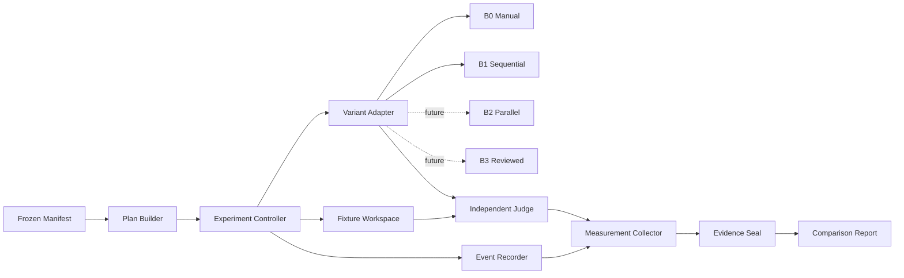
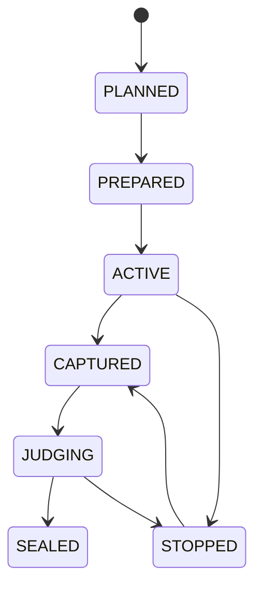

# 범용 오케스트레이터 Benchmark Runner 설계

- 문서 상태: 동결(freeze) — R0 계약 명명 erratum 반영
- 동결일: 2026-08-05
- 설계 판본: 4
- 작성일: 2026-08-05
- 적용 범위: B0~B3 비교 실험을 실행·측정·판정하는 중립 Runner
- 최초 적용: 동결된 B0/B1 비교 실험
- 구현 상태: 미구현
- 기준 문서: [범용 로컬 세션 오케스트레이터 설계](./general-local-session-orchestrator-design.md), [B1 최소 오케스트레이터 구현 명세](./b1-minimum-orchestrator-implementation-spec.md)
- 1차 심사: [Claude Benchmark Runner 설계 심사](../reviews/benchmark-runner/claude-review-general-benchmark-runner-design.md)
- 재심사: [Claude Benchmark Runner 설계 재심사](../reviews/benchmark-runner/claude-rereview-general-benchmark-runner-design.md)
- 최초 입력: [`b0-b1-frozen.yaml`](../../benchmarks/manifests/b0-b1-frozen.yaml)

> 이 문서는 오케스트레이터 자체가 아니라 오케스트레이터 단계들을 같은 조건에서 실행하고 심판하는 별도 프로그램을 정의한다. Runner가 특정 단계의 내부 코드나 성공 주장에 의존하면 비교가 오염되므로, 공통 코어와 단계별 Variant Adapter를 분리한다.

> 동결 정책: 구조·책임·공개 계약·구현 순서를 이 판본으로 확정한다. §27의 실행계획 입력값은 원문 증거와 실제 환경으로 첫 Cell 전에 채우는 미확정값이며 임의로 추측하지 않는다. 설계를 바꾸려면 새 지시, 변경 사유, 새 판본이 필요하다.

## 0. 먼저 읽을 결론

현재 저장소에는 비교할 B0·B1, 두 fixture, 동결 manifest, B0 측정 스키마, B1 실행 보고서가 있다. 그러나 12개 실험 Cell을 같은 방식으로 준비하고, 사람 개입을 즉시 기록하고, 독립 Check를 실행하고, 결과를 공통 형식으로 봉인·집계하는 실행기는 없다.

이를 해결하는 최소 구조는 다음과 같다.

```text
범용 Benchmark Runner
├─ 동결 manifest와 실행계획 검증
├─ fixture를 source commit에서 독립 Git 저장소로 복원
├─ Cell 순서·시간·중단 조건 관리
├─ 사람 개입 Event 기록
├─ Variant Adapter를 통한 B0/B1/B2/B3 실행
├─ Variant와 독립된 최종 Judge
├─ 공통 Measurement와 Evidence 봉인
└─ baseline/candidate 비교와 채택 게이트 판정
```

Runner 코어는 `b0`, `b1`이라는 이름의 의미를 해석하지 않는다. 현재 첫 실험만 `B0ManualAdapter`, `B1SequentialAdapter`를 등록한다. B2·B3가 실제로 구현되면 새 Adapter와 선택적 보조 지표만 추가하며, fixture 준비·공통 지표·Judge·Cell 상태기계·봉인 형식은 바꾸지 않는다.

첫 B0/B1 비교는 다음 12개 Cell이다.

```text
2 fixture × 2 variant × 3 repetition = 12 Cell
```

Runner 구현은 B2나 B3를 만드는 작업이 아니다. B1이 B0보다 낫다는 증거를 얻기 전에는 `B2ParallelAdapter`를 실제 구현하지 않는다.

---

## 1. 목적과 검증 질문

### 1.1 목적

Runner의 목적은 다음 세 가지다.

1. 비교 대상 외 조건을 고정한다.
2. 성공·실패·사람 개입·비용을 같은 의미로 측정한다.
3. 실패나 중단을 버리지 않고 재현 가능한 증거로 남긴다.

Runner는 결과를 좋게 만드는 프로그램이 아니라 결과를 믿을 수 있게 만드는 프로그램이다.

### 1.2 최초 검증 질문

B0/B1의 질문은 다음과 같다.

> 사용자가 Codex 단일 세션을 직접 운영하는 B0보다, 단일 Worker를 순차 실행하고 자동검사하는 B1이 결과 품질을 떨어뜨리지 않으면서 사람의 중계·복구 부담을 줄이는가?

### 1.3 이후 검증 질문

Runner 코어를 유지한 채 비교 manifest와 Adapter만 바꿔 다음 질문을 시험한다.

- B1 대 B2: 내부 병렬성이 전체 벽시계 시간을 줄이며 통합·재작업 비용이 이득을 먹지 않는가?
- B2 대 B3: Reviewer가 추가로 발견한 결함의 가치가 검토 시간·token·오탐 비용보다 큰가?
- 동일 단계의 정책 A/B: thread 재사용, 모델 선택, timeout, retry 정책 변화가 품질·비용에 어떤 영향을 주는가?

한 번의 거대한 B0~B3 리그전을 기본으로 하지 않는다. 각 단계는 직전 채택 단계와 인접 비교하고, 통과한 구현만 다음 비교의 baseline이 된다.

---

## 2. 현재 근거와 미구현 부분

### 2.1 이미 존재하는 것

- B0 수동 기준선과 고정 프롬프트
- B1 순차 오케스트레이터와 실제 Codex smoke
- `code-change`, `document-read` fixture
- fixture source commit과 Git tree hash
- 모델·인증·반복·예산·중단 규칙이 있는 동결 manifest
- B0 측정 JSON Schema
- B1 Run·Task·Attempt·Session·Check·usage 보고서

### 2.2 아직 없는 것

- 12개 Cell의 순서를 사전에 확정한 실행계획
- B0/B1이 공유하는 Measurement Schema
- 개입을 발생 즉시 기록하는 Event 수집기
- 두 variant 결과에 같은 방식으로 적용하는 외부 Judge
- 실험 중단·재개·revision 교체 규칙을 집행하는 상태기계
- 원시 증거를 봉인하고 결정론적으로 요약하는 exporter
- B1 채택 게이트를 계산하는 비교기

### 2.3 현재 형식의 불일치

B0 measurement에는 `attempt_count`, 오케스트레이터 디버깅 시간, `human_errors_after_pass`가 없다. B1 report의 `manual_copy_or_relay_count`와 `manual_recovery_seconds`는 현재 `null`이며 `manual_recovery_count`는 없다. 두 형식 중 하나를 다른 쪽에 억지로 맞추지 않고 Runner 공통 Measurement로 정규화한다.

기존 B0 스키마와 B1 report는 원시 Evidence로 보존한다. 공통 Measurement는 이 원시 자료와 Runner Event에서 파생하며, 파생 출처를 함께 기록한다.

---

## 3. 설계 원칙

### 3.1 한 변수만 바꾼다

fixture, 요청, 모델, 인증, 예산, Check는 같게 유지한다. 실행 표면의 system instruction·도구·approval까지 같게 만들 수 있는지는 별도로 검증한다. 검증하지 못한 차이가 있으면 숨기지 않고 `treatment_control=partial`로 기록하며, 그 결과를 오케스트레이션 하나만의 인과효과로 해석하지 않는다.

### 3.2 선수와 심판을 분리한다

Variant의 자체 완료 보고와 자체 Check는 중요한 Evidence지만 최종 판정이 아니다. Runner의 Judge가 모든 variant 결과에 같은 고정 Check를 다시 실행한다.

### 3.3 실패를 지우지 않는다

실패·중단·timeout·usage unknown을 결과에서 제외하지 않는다. 설명하기 어려운 실패가 발생하면 다음 Cell을 자동 실행하지 않는다.

### 3.4 측정 불가는 0이 아니다

token, 사람 개입 시간, 세션 수를 직접 확인하지 못하면 `unknown`으로 기록한다. B0와 B1의 관측 가능성이 다르다는 사실도 결과의 일부다.

### 3.5 활성 상태와 공개 결과를 분리한다

실행 중 상태, 임시 Git 저장소, B1 state root, SDK 식별자는 사용자 로컬 state root에 둔다. 검증·redaction·봉인이 끝난 결과만 저장소의 `benchmarks/results/`로 내보낸다.

### 3.6 Runner는 새 오케스트레이터가 아니다

Runner는 Task를 분해하거나 AI에게 계획을 맡기지 않는다. 고정된 Cell을 한 번에 하나 실행하는 결정론적 실험 제어기다. 현재 Runner 자체는 병렬 Cell 실행을 지원하지 않는다.

### 3.7 내부 병렬성과 실험 병렬성을 구분한다

B2가 여러 Worker를 병렬 실행하더라도 이는 한 Cell 내부의 variant 동작이다. Runner는 Cell을 순차 실행해 구독 한도, 머신 부하, 시간대 교란을 줄인다.

### 3.8 미래 확장은 이름이 아니라 계약으로 한다

코어는 `B2=parallel`, `B3=reviewed`라는 이름을 조건문으로 해석하지 않는다. Adapter가 capabilities와 정규화 Evidence를 반환한다.

---

## 4. 범위

### 4.1 포함

- 동결 manifest 읽기와 hash 확인
- 범용 Execution Plan 생성과 봉인
- fixture source commit 복원과 Git tree 검증
- B0 수동 실행 sidecar
- B1 CLI Adapter
- 공통 Event·Measurement·Evidence 계약
- 독립 Judge
- deadline과 stop-on-unexplained-failure
- 단일 controller lock과 crash-safe atomic write
- 결과 redaction·hash·export
- paired summary와 채택 게이트
- Fake Adapter 기반 비라이브 회귀시험

### 4.2 제외

- B2·B3 구현
- Runner가 Codex 작업을 직접 계획하거나 수정하는 기능
- 여러 Cell의 동시 실행
- 웹 대시보드
- 원격 분산 실행
- 데이터베이스 서버
- 자동 Git commit·push
- 실패한 confirmatory 결과의 자동 대체
- 통계적 유의성을 가장하는 추론

### 4.3 구현 언어

최초 reference 구현은 B1과 같은 Python 3.12를 사용한다. 파일 기반 원장과 JSON Schema를 사용하며 별도 DB는 두지 않는다. Cell 12개 규모에서 SQLite를 추가하는 것은 현재 필요보다 크다.

---

## 5. 용어

| 용어 | 의미 |
|---|---|
| Experiment | 하나의 동결 manifest와 실행계획으로 묶인 전체 비교 |
| Revision | 비교 대상 구현·Runner·판정 계약이 같은 Experiment 판본 |
| Block | 같은 fixture와 repetition에 속한 baseline/candidate 쌍 |
| Cell | variant 하나를 fixture 하나에서 한 번 실행하는 최소 실험 단위 |
| Variant | 비교할 실행 방식. 예: B0, B1, 이후 B2, B3 |
| Adapter | Variant를 Runner 공통 계약에 연결하는 구현 |
| Intervention | 사람이 작업 결과에 영향을 주기 위해 한 중계·수정·재시도·복구 행동 |
| Judge | Variant와 독립적으로 최종 Check를 실행하는 판정기 |
| Evidence | Event, 명령 결과, hash, Check 결과 등 Measurement의 근거 |
| Measurement | Evidence를 공통 의미로 정규화한 Cell 결과 |
| Seal | Measurement와 그 안의 Evidence 목록·hash를 확정해 이후 변경을 탐지하는 행위 |

---

## 6. 전체 구조



### 6.1 책임 경계

| 구성요소 | 소유하는 것 | 소유하지 않는 것 |
|---|---|---|
| Plan Builder | Cell 집합, 순서, seed, contract hash | Variant 실행 |
| Controller | 상태, deadline, 중단, 다음 Cell 선택 | Task 계획, 결과 수정 |
| Workspace | source commit 복원, tree 검증, final diff | Git reset으로 결과 복구 |
| Adapter | Variant 실행과 원시 Evidence 수집 | 최종 성공 판정 |
| Event Recorder | 사람 행동과 timestamp | 행동의 정당성 판단 |
| Judge | 공통 Check 실행 | Variant 내부 재시도 |
| Collector | 공통 Measurement 정규화 | unknown 값 추정 |
| Sealer | hash, immutable export | Git commit·push |
| Reporter | paired 표와 gate 계산 | 사후 기준 변경 |

### 6.2 의존 방향

Runner는 B1 Python 모듈을 import하지 않는다. `lao` 공개 CLI와 JSON 출력만 사용한다. B2·B3도 같은 원칙을 따른다.

```text
Runner Core → VariantAdapter Protocol
                     ↑
        B0/B1/B2/B3 Adapter

Runner Core ──X──> orchestrator.schedule 내부 함수
Runner Core ──X──> B1 SQLite 직접 조회
```

B1의 정식 report와 `recover check` 출력은 공개 Evidence다. 내부 SQLite가 필요해지면 B1에 export 명령을 추가한 뒤 공개 계약으로 사용하며 Runner가 DB schema에 직접 결합하지 않는다.

---

## 7. 제안 디렉터리 구조

`benchmarks/`는 입력과 결과를 보존하고 구현 소스는 두지 않는다는 현재 규칙을 유지한다. Runner 구현은 `tools/`에 둔다.

```text
tools/benchmark-runner/
├─ pyproject.toml
├─ README.md
├─ src/benchmark_runner/
│  ├─ contract.py      공통 Pydantic 계약과 Schema export
│  ├─ plan.py          manifest 정규화와 균형 실행계획
│  ├─ workspace.py     fixture 복원·tree·diff·hash
│  ├─ adapter.py       VariantAdapter와 B0/B1 등록
│  ├─ runner.py        Cell 제어·Event·측정·봉인·집계
│  ├─ judge.py         공통 Check 실행
│  └─ cli.py           `lao-bench` 명령
├─ schemas/v1/
│  ├─ execution-plan.schema.json
│  ├─ intervention-event.schema.json
│  └─ measurement.schema.json
└─ tests/
   ├─ unit/
   ├─ contract/
   ├─ integration/
   └─ fixtures/fake-adapters/

benchmarks/
├─ fixtures/           동결 입력
├─ manifests/          실험 조건
└─ results/
   ├─ b0/              봉인된 B0 Cell export
   ├─ b1/              봉인된 B1 Cell export
   ├─ b2/              이후 사용
   ├─ b3/              이후 사용
   └─ comparisons/     Experiment 단위 plan·summary·gate
```

Runner 자체의 공개 스키마는 외부 교환이 필요한 세 가지뿐이다. 활성 Cell 상태는 내부 Pydantic 모델이고, Evidence 목록은 Measurement에 포함한다. 비교 summary는 봉인된 Measurement와 Execution Plan에서 결정론적으로 다시 만들 수 있는 파생 출력이므로 최초 판본에서는 별도 공개 스키마를 두지 않는다. §14.3의 두 Schema는 Runner가 아니라 B1 CLI의 공개 출력 계약이다.

활성 실행 상태의 기본 위치는 Git 밖이다.

```text
Windows:
%LOCALAPPDATA%/local-agent-orchestrator/benchmarks/<experiment_id>/

POSIX:
${XDG_STATE_HOME:-~/.local/state}/local-agent-orchestrator/benchmarks/<experiment_id>/
```

시험에서는 `LAO_BENCH_STATE_ROOT`로 임시 경로를 강제한다.

---

## 8. 범용 계약

### 8.1 Contract Envelope

모든 공개 JSON은 다음 공통 필드를 갖는다.

```json
{
  "schema_version": 1,
  "kind": "measurement",
  "created_at": "2026-08-05T00:00:00Z",
  "producer": "lao-bench/0.1.0"
}
```

알 수 없는 필드는 기본 거부한다. timestamp는 UTC RFC 3339, duration은 monotonic clock으로 계산한 초 단위 숫자다.

### 8.2 Experiment Identity

```text
plan_identity_payload = canonical_execution_plan excluding
                        {experiment_id, plan_fingerprint, created_at}
plan_fingerprint = sha256(plan_identity_payload)
experiment_id    = exp_<date>_<plan_fingerprint_8>_<revision>
block_id      = block_<fixture_id>_<repetition>
cell_id       = cell_<fixture_id>_<repetition>_<variant_id>
```

사용자 입력 이름만으로 경로를 만들지 않는다. ID는 허용 문자 집합을 검증한다. 같은 manifest라도 baseline/candidate, seed, 판정식, reasoning 통제 방식이 다르면 Plan fingerprint와 Experiment ID가 달라진다.

### 8.3 Normalized Experiment Spec

현재 동결 manifest v1은 수정하지 않는다. Loader가 다음 내부 계약으로 정규화한다.

```yaml
schema_version: 1
source_manifest:
  path: benchmarks/manifests/b0-b1-frozen.yaml
  sha256: 5633...
baseline_variant: b0
candidate_variants: [b1]
fixtures: [...]
repetitions: 3
budgets: {...}
primary_metrics: [...]
decision_policy: {...}
```

기존 `manifest.schema.json`의 `b0|b1` enum은 과거 실험 입력의 계약으로 남긴다. B2/B3 실험은 새 manifest schema 판본을 사용하되 Runner의 Normalized Spec은 `variant_id: string`이므로 코어 변경이 필요 없다.

권위 순서는 다음과 같다.

```text
동결 manifest의 정확한 bytes
  → manifest에서 결정론적으로 파생한 Normalized Spec
  → manifest가 말하지 않은 항목만 보충한 Execution Plan
  → Cell Measurement
  → Measurement에서 결정론적으로 파생한 Summary
```

Plan이 manifest와 충돌하면 생성을 거부한다. 보충한 값은 `plan_supplemented`에 필드명·값·출처를 기록한다. 현재 manifest가 명시하지 않은 baseline/candidate, 고정 seed, 숫자 판정식, reasoning 통제 정책은 사용자가 첫 Cell 전에 제공하는 Plan 보충값이며 manifest의 일부인 것처럼 서술하지 않는다.

### 8.4 Execution Plan

Execution Plan은 실행 전에 생성하고 다음을 포함한다.

- manifest path와 SHA-256
- Runner source commit과 package hash
- 각 Variant artifact/version/hash
- fixture source commit과 tree
- block과 Cell 목록
- Cell 실행 순서와 생성 seed
- 공통 환경 fingerprint
- primary metric과 decision policy
- baseline/candidate와 각 값의 출처
- model·reasoning 통제 정책과 검증 결과
- manifest에 없어서 보충한 `plan_supplemented` 목록
- 생성 시점과 생성 도구 버전

Plan은 canonical JSON으로 hash한다. 순환 참조를 막기 위해 identity payload에서는 `experiment_id`, `plan_fingerprint`, `created_at`만 제외하고 baseline/candidate, seed, decision policy, reasoning control을 모두 포함한다. fingerprint를 계산한 뒤 Experiment ID와 함께 완성된 Plan을 쓴다. 첫 Cell 시작 뒤 수정할 수 없고, 수정이 필요하면 새 revision을 만든다.

### 8.5 MetricValue

관측 불가와 0을 구분하기 위해 선택적 지표는 공통 envelope를 사용한다.

```json
{
  "status": "measured",
  "value": 12,
  "unit": "count",
  "source": "runner_event_log",
  "evidence_ref": "events/interventions.jsonl"
}
```

`status`는 다음 중 하나다.

- `measured`: 직접 측정됨
- `derived`: 봉인된 Evidence에서 결정론적으로 계산됨
- `unknown`: 관측 경로 없음 또는 실패
- `not_applicable`: 해당 Variant에 개념 자체가 없음

`unknown`과 `not_applicable`에는 `value`를 두지 않는다.

### 8.6 Core Measurement

모든 Variant가 반환해야 하는 공통 결과다.

```yaml
identity:
  experiment_id: exp_...
  block_id: block_code-change_1
  cell_id: cell_code-change_1_b1
  fixture_id: code-change
  repetition: 1
  variant_id: b1
  execution_ordinal: 2
provenance:
  manifest_sha256: ...
  fixture_source_commit: ...
  fixture_tree_before: ...
  fixture_tree_after: ...
  runner_commit: ...
  variant_version: ...
  variant_artifact_sha256: ...
environment:
  os: windows
  python_version: 3.12.10
  model: gpt-5.6-terra
  auth_method: chatgpt
  reasoning_effort: low
  surface_kind: codex_sdk
  approval_mode: deny_all
  model_control: verified
  reasoning_control: verified
  treatment_control: partial
outcome:
  state: completed
  failure_kind: null
  check_success: true
effort:
  variant_execution_seconds: {...}
  judge_seconds: {...}
  total_wall_clock_seconds: {...}
  startup_action_count: {...}
  manual_copy_or_relay_count_excluding_start: {...}
  manual_copy_or_relay_count_including_start: {...}
  manual_recovery_count: {...}
  manual_recovery_seconds: {...}
resource:
  session_count: {...}
  turn_count: {...}
  attempt_count: {...}
  token_usage: {...}
quality:
  errors_found_by_automatic_checks: {...}
  human_errors_after_pass: {...}
integrity:
  scope_ok: true
  evidence_hashes_ok: true
  secret_findings: []
evidence:
  - path: judge/result.json
    size: 1234
    sha256: ...
variant_metrics:
  schema_id: b1-sequential/v1
  values: {}
```

`variant_metrics`는 B2 concurrency나 B3 review 지표 같은 보조 자료다. 공통 gate는 Core Measurement만 사용한다. 새 보조 지표가 필요해도 Core Schema를 즉시 바꾸지 않는다.

### 8.7 Intervention Event

사람 개입은 회상으로 작성하지 않고 발생 즉시 append-only JSONL로 기록한다.

```json
{
  "schema_version": 1,
  "event_id": "evt_...",
  "cell_id": "cell_code-change_1_b0",
  "timestamp": "2026-08-05T00:01:20Z",
  "monotonic_offset_seconds": 80.42,
  "kind": "intervention_event",
  "intervention_kind": "correction",
  "actor": "user",
  "duration_seconds": 12.5,
  "note": "write scope 재설명"
}
```

허용 `intervention_kind`와 기계 계수 규칙:

| kind | startup | excluding-start 중계 | 그 밖의 효과 |
|---|---:|---:|---|
| `initial_prompt_copy` | 1 | 0 | B0 turn +1 |
| `b1_start` | 1 | 0 | B1 turn은 report에서 수집 |
| `additional_prompt` | 0 | 1 | B0 turn +1 |
| `correction` | 0 | 1 | B0 turn +1 |
| `manual_retry` | 0 | 1 | B0 turn·attempt +1 |
| `recovery_start`, `recovery_end` | 0 | 0 | 완전한 쌍만 recovery count·duration 계산 |
| `session_replacement` | 0 | 0 | B0 session +1 |
| `status_observation` | 0 | 0 | 결과에 영향 없는 조회 |
| `abort` | 0 | 0 | outcome을 interrupted로 기록 |

필수 시작 동작과 결과에 영향을 주는 실행 중 개입을 구분한다. B0 `initial_prompt_copy`와 B1 `b1_start`는 각각 `startup_action_count=1`로 대칭 기록한다. primary 사람 부담 게이트는 시작 동작을 뺀 `manual_copy_or_relay_count_excluding_start`를 사용한다. 과거 manifest 문구와의 비교를 위해 시작을 포함한 값도 `manual_copy_or_relay_count_including_start`로 파생하되, 첫 Cell 전에 이 해석을 Plan에 고정한다.

### 8.8 Evidence 목록과 봉인

Cell을 봉인할 때 모든 공개 Evidence의 상대 경로·크기·SHA-256을 정렬해 Measurement의 `evidence` 목록에 넣는다. canonical Measurement bytes의 SHA-256은 내부 Cell 상태의 `sealed_measurement_sha256`에 원자적으로 기록한다. Measurement는 자기 자신을 Evidence 목록에 넣지 않는다.

Git export에는 모든 Cell의 `cell_id`, Measurement 상대 경로, `sealed_measurement_sha256`, `sealed_at`을 `cell_id` 순으로 정렬한 `comparisons/<experiment_id>/seals.json`을 함께 쓴다. 저장소 감사자는 이 값을 canonical `measurement.json`과 대조한다. `seals.json`은 외부에서 작성하는 네 번째 입력 Schema가 아니라 봉인된 내부 상태에서 결정론적으로 생성하는 export index다. 이 index와 Git commit을 기준점으로 사용하면 별도 Evidence Manifest 없이 Measurement와 그 Evidence를 재검증할 수 있다.

절대 경로, `..`, symlink, token 형태 문자열은 export에서 거부한다.

---

## 9. Variant Adapter

### 9.1 Protocol

개념적 경계는 다음과 같다.

```text
id()                                      -> variant_id
capabilities()                            -> VariantCapabilities
preflight(cell_context)                   -> PreflightResult
run(cell_context)                         -> VariantEvidence
```

Runner가 호출하는 Adapter method는 결정론적 제어 경계다. B0 Adapter의 `run`은 사용자 입력 loop와 타이머를 소유하고, B1 Adapter의 `run`은 subprocess와 deadline을 소유한다. Adapter는 최종 `check_success`를 결정하지 않는다.

`observe`와 `request_stop`은 B0/B1에 공통으로 실행 가능한 경계가 아니므로 최초 Protocol에 두지 않는다. 실제 B2가 공개 관측·중단 계약을 제공한 뒤 두 개 이상의 Adapter가 같은 의미로 필요로 할 때 별도 capability와 method 승격을 검토한다.

### 9.2 Capabilities

```yaml
automated_launch: true | false
supports_usage: true | false
supports_attempt_count: true | false
```

지원하지 않는 지표를 0으로 반환하지 않는다. Runner는 capability와 Measurement status가 모순되면 Cell을 봉인하지 않는다.

### 9.3 Adapter 등록

manifest 문자열로 임의 Python module을 import하지 않는다. 실행 파일에 등록한 allow-list에서만 Adapter를 선택한다.

```text
b0-manual     -> B0ManualAdapter
b1-sequential -> B1SequentialAdapter
```

B2·B3가 구현된 뒤 다음 등록을 별도 변경으로 추가한다.

```text
b2-parallel -> B2ParallelAdapter
b3-reviewed -> B3ReviewedAdapter
```

### 9.4 미래 Adapter 규칙

- B2 Adapter는 내부 Worker를 직접 제어하지 않고 B2 공개 실행 계약을 호출한다.
- B2 concurrency, merge, integration 자료는 `variant_metrics`에 둔다.
- B3 Adapter는 Reviewer 횟수·판정·추가 결함 Evidence를 정규화한다.
- B3 자체 성공 판정을 Judge 성공으로 바꾸지 않는다.
- Adapter 추가 때문에 Cell 상태기계나 공통 Measurement를 바꾸지 않는다.

---

## 10. 상태기계

### 10.1 Experiment 제어 기록과 파생 상태

Experiment에는 Cell 상태기계와 별도로 동기화해야 하는 두 번째 상태기계를 두지 않는다. 다음 최소 제어 메타데이터만 저장한다.

```yaml
preflight:
  completed_at: ...
  evidence_sha256: ...
stop_reason: null
stop_history: []
superseded_by: null
analysis_sha256: null
export_sha256: null
```

CLI에 표시하는 Experiment 상태는 Cell 상태와 이 제어 기록에서 우선순위대로 파생한다.

1. `superseded_by`가 있으면 `SUPERSEDED`
2. `stop_reason`이 있으면 `STOPPED`
3. 모든 Cell이 `SEALED`이고 유효한 export hash가 있으면 `FROZEN`
4. 모든 Cell이 `SEALED`이고 유효한 summary가 있으면 `ANALYZED`
5. 모든 Cell이 `SEALED`이면 `COMPLETED`
6. 하나 이상의 Cell이 `PREPARED` 이상이면 `RUNNING`
7. preflight Evidence가 유효하면 `PREFLIGHTED`
8. 그 외에는 `CREATED`

`STOPPED`에서 계속하려면 원인·결정 주체·시각·근거를 `stop_history`에 append한 뒤에만 `stop_reason`을 해제할 수 있다. 이전 reason을 덮어써서 잃지 않는다. 코드나 계약 변경이 필요하면 같은 revision을 재개하지 않고 `superseded_by`를 기록한다.

### 10.2 Cell 상태



Cell의 작업 결과는 별도 `outcome.state`로 기록한다.

```text
completed | failed | blocked | interrupted | timed_out | infrastructure_error
```

실패 Cell도 가능한 Evidence를 수집하고 `SEALED`한다. `SEALED`는 성공이 아니라 결과가 변경 불가능하게 기록됐다는 뜻이다.

### 10.3 원자성

상태 JSON은 같은 디렉터리의 임시 파일에 쓰고 `fsync` 후 `os.replace`한다. Event JSONL은 한 프로세스만 append하며 각 줄을 flush한다. Experiment마다 controller lock 하나를 둔다. Lock에는 PID, hostname, 획득 시각, Runner version, experiment ID를 기록한다.

Runner 재시작 시 마지막 완전한 상태와 Event를 읽는다. `ACTIVE` Cell을 자동 재실행하지 않고 `STOPPED`로 전환해 사람이 runtime 상태를 확인하게 한다.

---

## 11. Execution Plan과 순서

### 11.1 Cell 확장

현재 manifest의 fixture 2개, variant 2개, repetition 3을 곱하면 다음 12개 Cell로 파생된다. manifest에 숫자 `12`가 직접 적혀 있는 것은 아니다.

```text
code-change × repetition 1..3 × b0,b1
document-read × repetition 1..3 × b0,b1
```

### 11.2 Blocked order

B0를 전부 실행한 뒤 B1을 실행하지 않는다. 시간대, 사용량 한도, 사용자 숙련도, 서비스 상태가 variant와 겹치기 때문이다.

같은 fixture와 repetition의 B0/B1을 하나의 Block으로 묶는다. 두 variant의 선행 순서를 균형화한다.

예시:

```text
block code-change/1:    b0 → b1
block document-read/1:  b1 → b0
block code-change/2:    b1 → b0
block document-read/2:  b0 → b1
block code-change/3:    b0 → b1
block document-read/3:  b1 → b0
```

실제 패턴의 시작 방향은 고정 seed로 결정한다. 전체 6 Block에서 b0-first와 b1-first가 각각 3개가 되게 한다. 생성한 순서와 seed는 첫 Cell 전에 Plan에 봉인한다.

### 11.3 새 세션 원칙

각 Cell은 새 runtime session에서 시작한다. 이전 Cell의 thread를 재사용하지 않는다. thread 재사용 자체를 시험하려면 별도 manifest에서 독립 변수로 다룬다.

### 11.4 중단 후 순서

설명되지 않은 실패가 발생하면 뒤의 순서를 압축하거나 건너뛰지 않는다. 제어 기록에 `stop_reason`을 쓰고 남은 Cell은 `PLANNED` 상태로 유지한다.

---

## 12. Fixture 준비

### 12.1 source worktree를 복사하지 않는다

현재 작업 트리의 fixture 디렉터리를 단순 복사하면 미커밋 변경이 섞일 수 있다. Runner는 manifest의 source commit에서 `git archive`로 fixture를 추출한다.

개념 절차:

```text
verify source commit exists
verify <commit>:<fixture_path> tree == manifest.git_tree
git archive source commit -- fixture_path
safe extract to new Cell directory
strip fixed fixture prefix
git init -b main
git add all
git write-tree
assert tree == manifest.git_tree
git commit with fixed benchmark identity
assert worktree clean
```

tar entry가 fixture prefix 밖으로 나가거나 symlink면 거부한다.

### 12.2 Cell별 독립 경로

```text
<state_root>/experiments/<experiment_id>/cells/<cell_id>/workspace/
```

두 variant가 같은 디렉터리를 공유하지 않는다. 한 Cell 종료 뒤 workspace를 다음 repetition에 재사용하지 않는다.

### 12.3 환경 fingerprint

다음을 기록한다.

- OS와 architecture
- Python executable과 version
- Git version
- Codex SDK/CLI version
- Runner version/commit
- Variant artifact hash
- model·reasoning 설정과 각각의 검증 방식
- surface kind(`codex_app`, `codex_cli_interactive`, `codex_sdk` 등)
- approval mode
- 기본 instruction·도구 노출의 비교 가능 여부
- `treatment_control: full|partial`
- auth method만 기록하고 계정 식별자는 제외
- API key 환경 변수 존재 여부 boolean

민감한 전체 환경 변수 목록은 저장하지 않는다.

### 12.4 실행 Python

fixture Check의 `python`은 우연히 PATH에서 발견한 인터프리터에 맡기지 않는다. Runner preflight에서 고정한 benchmark Python의 Scripts 디렉터리를 Cell subprocess PATH 앞에 두고 실제 executable/version을 기록한다. B0·B1 Judge가 같은 Python을 사용해야 한다.

---

## 13. B0 Manual Adapter

### 13.1 역할

B0 Adapter는 Codex 작업을 자동 중계하지 않는다. 다음만 제공하는 측정 sidecar다.

- 독립 workspace와 고정 prompt 경로 출력
- 실행 타이머
- 사용자 개입 Event 입력
- session·turn count 근거 기록
- 종료 선언과 원시 메모 수집

### 13.2 실행 흐름

```text
Runner: Cell 준비와 prompt 표시
User:   새 Codex 세션을 fixture에서 시작
User:   고정 prompt 전달
Runner: initial_prompt_copy 시작 Event
User:   정상 세션 운영
Runner: 추가 지시가 생길 때 즉시 Event
User:   작업 완료·실패·중단 선언
Runner: Adapter Evidence 수집
Runner: 독립 Judge 실행
```

### 13.3 모델·reasoning·세션 확인

B0도 model과 reasoning이 고정됐다는 Evidence가 필요하다. 구현 전에 실제 Codex 표면에서 두 값을 명시하고 확인할 수 있는 지원 경로를 확정한다.

우선순위:

1. 공식 CLI에서 model·reasoning·cwd를 명시한 새 interactive session
2. Codex 앱에서 모델·reasoning 선택과 새 Task를 사용자가 확인하고 Runner에 attestation
3. model을 확인할 수 없으면 preflight 실패. reasoning만 확인할 수 없으면 첫 Cell 전에 `reasoning_control=not_established`, `treatment_control=partial`로 Plan에 고정하고 workflow 비교 한계를 수용한 경우에만 진행

Runner가 앱 UI를 자동 조작하거나 Desktop task를 정본으로 삼지는 않는다.

### 13.4 Turn 계산

- 최초 prompt를 turn 1로 기록한다.
- 사용자의 추가 prompt마다 turn을 1 증가시킨다.
- 모델 내부 tool call은 turn으로 세지 않는다.
- 새 세션으로 교체하면 `session_replacement`와 새 session을 기록한다.
- 실제 표면에서 usage를 얻지 못하면 `token_usage.status=unknown`이다.

### 13.5 B0에서 세지 않는 것

- Runner가 fixture를 준비하는 시간
- Runner가 공통 Judge를 실행하는 동작
- 결과에 영향을 주지 않는 상태 확인
- 실험 전 설치·로그인 시간

최초 prompt copy는 B1 시작 명령과 대칭인 `startup_action_count`로 세고, 결과에 영향을 주는 추가 중계는 `manual_copy_or_relay_count_excluding_start`로 센다.

### 13.6 B0 측정 권위와 사용자 확인

이번 Experiment의 B0 중계·복구 측정 정본은 Runner가 실시간 기록한 Intervention Event다. 기존 B0 측정 스키마와 runbook은 과거 Evidence로 보존하지만 같은 Cell을 별도 규칙으로 이중 측정하지 않는다. 최종 성공 판정도 B0 작업자의 완료 선언이 아니라 Runner Judge가 소유한다.

봉인 직전 Runner는 Event timeline과 파생 횟수·시간을 사용자에게 보여주고 “누락 없이 기록됐다”는 attestation을 받는다. attestation이 없거나 사용자가 누락을 선언하면 무기한 미봉인 상태로 두지 않는다. 가능한 Evidence를 수집해 `outcome.state=infrastructure_error`, `failure_kind=measurement_attestation_missing`으로 봉인하고 Experiment `stop_reason`을 기록한다. 이 절차는 회상 편향을 줄이지만 B0 측정이 사람 입력에 의존한다는 한계 자체를 제거하지는 않는다.

---

## 14. B1 Sequential Adapter

### 14.1 경계

B1 Adapter는 설치된 `lao` CLI를 argv 배열로 실행한다. `shell=True`를 사용하지 않고 B1 내부 모듈이나 DB를 import하지 않는다.

### 14.2 preflight

Cell마다 다음 순서로 확인한다.

1. `OPENAI_API_KEY` 없음
2. runtime profile의 model·auth·reasoning이 Execution Plan과 일치
3. `lao doctor --project <workspace> --json` 성공
4. SDK `0.144.4`, ChatGPT 인증, clean worktree
5. `lao run validate` 성공
6. Cell 전용 `LAO_STATE_ROOT`가 비어 있음

B0 표면과 B1 SDK에서 model·reasoning을 모두 검증하지 못하면 해당 값은 `reasoning_control: not_established`처럼 명시한다. 기본 instruction, 사용 가능 도구, approval mode까지 동등함을 증명하지 못하면 `treatment_control: partial`로 기록하고 이 실험을 “오케스트레이션만의 순수 인과효과”가 아니라 실제 운영 표면을 포함한 workflow 비교로 해석한다.

### 14.3 공개 출력 계약 선행 조건

B1 Adapter를 구현하기 전에 B1의 평범한 dict 출력인 `_status()`와 `generate_report()`를 각각 `RunStatusEnvelope`, `RunReportEnvelope` Pydantic 공개 계약으로 승격한다. CLI는 이 모델의 검증된 dump를 출력하고 `scripts/export_schemas.py`는 모델에서 다음 JSON Schema를 생성해야 한다.

- `run-status.schema.json`
- `run-report.schema.json`

스키마를 손으로 따로 작성하지 않는다. 두 Pydantic 계약에는 terminal state, Run ID, usage status와 usage 값의 의미가 포함돼야 한다. B1 contract test가 실제 CLI JSON과 생성된 Schema의 일치를 검증하고, Runner는 수집 시 다시 검증한다. 누락·unknown field·스키마 불일치는 결과 실패가 아니라 `infrastructure_error`로 기록하고 Experiment 제어 기록에 stop reason을 남긴다. 이 공개 계약 승격은 B1 소스 변경이므로 R6에서 새 wheel을 만들며, 계약과 Schema가 생기기 전에는 B1 Adapter 구현 단계로 넘어가지 않는다.

usage 어휘는 두 층위를 명시적으로 분리한다. session 층 `UsageStatus`는 `measured|unknown|unsupported`, report 집계 층은 `measured|partial_or_unknown`이다. Runner core `token_usage`는 report 집계 층만 정규화하고, status가 session별 usage를 노출하는 경우 그 값은 `variant_metrics.b1_session_usage_statuses`에 원형 보존한다. session 층 `unsupported`는 core `not_applicable`이 아니라 `unknown`으로 취급한다.

### 14.4 실행

```text
set LAO_STATE_ROOT=<cell>/variant-state
start monotonic timer
record b1_start Event
lao run start --project <workspace> --spec <run-spec> --runtime codex
capture exit code and bounded stdout/stderr
extract run_id from public JSON
lao run status <run_id> --json
lao report <run_id> --format json
lao recover check <run_id>
collect redacted public Evidence
```

### 14.5 종료 코드

- `0`: `run status --json`이 `COMPLETED` terminal 상태임을 증명할 때만 Judge 진행. 그 외에는 `infrastructure_error`와 stop
- `3`: blocked로 수집하고 Experiment 중단 여부 판정
- `4`: task failed로 수집
- `5`: integrity failure, 즉시 `stop_reason` 기록
- `6`: controller lock 문제, 즉시 `stop_reason` 기록
- `7`: runtime/auth 문제, 즉시 `stop_reason` 기록
- `130`: 사용자 또는 runtime interrupt로 `interrupted` 수집, Cell 봉인 후 Experiment stop
- 알 수 없는 코드: `infrastructure_error`, 즉시 `STOPPED`

Runner는 B1 실패 뒤 `run start`를 다시 호출하지 않는다. B1 내부 Attempt와 resume 정책만 treatment의 일부로 허용한다.

### 14.6 Evidence 정규화

- B1 `turns` → core `turn_count`
- B1 `sessions` → core `session_count`
- B1 `attempts` → core `attempt_count`
- B1 report 집계 `usage_status=measured` → core `token_usage.status=measured`
- B1 report 집계 `usage_status=partial_or_unknown` → core `token_usage.status=unknown`; 부분합을 전체값으로 사용하지 않음
- B1 session `usage_status=measured|unknown|unsupported` → `variant_metrics.b1_session_usage_statuses`; core 총합의 출처로 사용하지 않으며 `unsupported`도 core에서는 unknown
- usage status 누락·parse 실패 → core `token_usage.status=unknown`
- B1이 반환한 정수 subtotal은 `variant_metrics.b1_token_usage_raw`에 원형 보존
- B1 Check 기록 → variant internal check Evidence
- Runner Judge → core final `check_success`

`partial_or_unknown`의 모든 정수 값이 0이어도 측정된 0으로 승격하지 않는다.

### 14.7 인증 실행 권한

Windows 자격 증명 저장소에 ChatGPT 인증이 있는 경우 B1 프로세스는 그 저장소에 접근 가능한 동일 사용자 권한에서 실행해야 한다. 격리 sandbox가 자격 증명을 못 읽는 것을 로그아웃으로 오판하지 않도록 preflight 실행 주체를 기록한다.

---

## 15. B2·B3 확장 방식

### 15.1 B2

B2가 구현되고 B1/B2 manifest가 동결되면 Adapter가 B2의 공개 CLI를 호출한다. 코어 Measurement에는 최종 session·turn·attempt·시간·개입·Check만 정규화한다.

다음은 B2 전용 `variant_metrics` 후보이며 지금 코어 필드로 승격하지 않는다.

- peak concurrent sessions
- parallel span과 총 worker time
- merge/conflict count
- integration/rework seconds
- worker 결과 중 폐기된 비율

### 15.2 B3

B3 Adapter는 B3 공개 report에서 Reviewer Evidence를 수집한다.

보조 지표 후보:

- review count
- defects found by reviewer
- reviewer false positives
- review latency
- review token usage
- reviewer 이후 재작업 횟수

최종 Judge가 찾은 결함과 Reviewer가 주장한 결함을 분리한다.

### 15.3 공통 코어를 바꿔야 하는 조건

새 단계가 등장했다는 이유만으로 Core Schema를 바꾸지 않는다. 두 개 이상의 서로 다른 Adapter에서 같은 의미의 지표가 반복되고, baseline/candidate gate에 필요할 때만 공통 필드 승격을 검토한다.

---

## 16. 독립 Judge

### 16.1 목적

Variant가 `completed`를 주장해도 Judge 통과 전에는 `check_success=true`가 될 수 없다.

### 16.2 Check 원천

Judge는 동결 fixture의 `.orchestrator/checks.yaml`에서 manifest의 `success_check`와 공통 무결성 Check를 읽는다. 실행 workspace 안의 Check 파일이 원본 hash와 다르면 Check를 실행하기 전에 scope/integrity 실패로 판정한다.

### 16.3 고정 순서

```text
1. fixture baseline과 보호 파일 hash 확인
2. changed path 계산
3. 허용 write scope 확인
4. source/check 변조 확인
5. acceptance Check 실행
6. diff Check 실행
7. final tree·diff·stdout·stderr hash 저장
```

scope 검사는 작업자가 수정할 수 있는 Check보다 먼저 수행한다. 현재 `diff_check`는 trailing whitespace·충돌 표식 등을 찾는 diff lint이지 허용 경로를 증명하는 scope 검사로 취급하지 않는다. scope 판정은 위 2~4단계의 baseline tree·changed path·보호 hash 검사가 담당한다.

### 16.4 시간

시간은 다음 component로 분리한다.

- `variant_execution_seconds`
- `judge_seconds`
- `total_wall_clock_seconds`

primary 성능 비교는 `variant_execution_seconds`를 사용한다. `total_wall_clock_seconds`는 Runner의 Judge 비용까지 포함한 실제 운영 경과시간으로 별도 보고한다. 기존 manifest의 `wall_clock_seconds` 문구는 Plan에서 두 정의 중 어느 것을 뜻하는지 명시적으로 보충하며, 실행 뒤 의미를 바꾸지 않는다.

### 16.5 Check 오류 수

`errors_found_by_automatic_checks`는 실패한 실행 횟수가 아니라 서로 다른 실패 Check ID의 수다. 같은 Check를 반복 실패해도 하나의 결함 근거로 센다. 반복 횟수는 별도 Evidence에 남긴다. ID는 `variant_internal:<id>`와 `runner_judge:<id>`처럼 출처 namespace를 붙여 fixture Check가 발견한 결함과 Runner 자체 무결성·인프라 실패를 합계와 원시 Evidence에서 모두 구분한다.

### 16.6 사람 사후 오류

자동 Check 통과 후 고정된 사람 검수 항목이 있는 fixture만 `human_errors_after_pass`를 측정한다. 검수 계약이 없으면 0이 아니라 `not_applicable`이다. 실험 중 즉석 검수 기준을 추가하지 않는다.

---

## 17. 실행 알고리즘

### 17.1 Experiment 생성

```text
load and validate source manifest
hash exact manifest bytes
normalize legacy/current manifest to ExperimentSpec
resolve registered adapters
expand blocks and cells
apply only manifest-silent Plan supplements
reject any manifest/Plan conflict
generate balanced order from supplemented seed
resolve runner and variant artifact identities
validate decision policy
canonicalize and hash execution-plan.json
derive Experiment ID from Plan fingerprint
write atomic execution-plan.json
```

### 17.2 preflight

```text
acquire controller lock
verify source Git commit and fixture trees
verify benchmark Python and Git
verify every Adapter capability
verify model/auth without model turn
verify state root and disk space
verify results destination has no conflicting experiment ID
seal preflight evidence
record preflight evidence hash in Experiment control record
```

### 17.3 Cell 실행

```text
require valid preflight Evidence hash in Experiment control record
require preflight Evidence matches the frozen Plan fingerprint
otherwise refuse before workspace preparation or Cell state transition
select next PLANNED cell by plan ordinal
materialize fixture from source commit
verify tree and clean worktree
adapter.preflight
set Cell PREPARED
start monotonic timer
set Cell ACTIVE
adapter.run while adapter-specific boundary enforces deadline
record B0 interactive interventions or B1 subprocess evidence
capture returned, timed-out, interrupted, or stopped VariantEvidence
set Cell CAPTURED
run independent Judge
normalize Measurement
scan and hash Evidence
seal Cell
if unexplained/integrity/auth/unexpected-usage-route failure:
    record Experiment stop_reason
else if cells remain:
    continue only on explicit next command
derive Experiment display state from Cell states and control record
```

Runner는 Cell 하나가 끝났다고 즉시 다음 유료 Cell을 자동 호출하지 않는다. 최초 구현의 `run next` 한 번은 Cell 하나만 실행하며 `run all`은 제공하지 않는다.

### 17.4 분석

```text
require every planned cell has sealed result
validate all evidence hashes
group cells by block
compare baseline/candidate within block
aggregate per fixture and overall
apply frozen decision policy
write summary.json and deterministic summary.md
record analysis_sha256; derive Experiment display state
```

---

## 18. CLI

제안 명령은 다음과 같다.

```powershell
lao-bench plan create `
  --manifest benchmarks/manifests/b0-b1-frozen.yaml `
  --baseline b0 `
  --candidate b1 `
  --seed 20260805

lao-bench experiment preflight EXPERIMENT_ID --json
lao-bench experiment status EXPERIMENT_ID --json
lao-bench run next EXPERIMENT_ID
lao-bench run cell EXPERIMENT_ID CELL_ID

lao-bench event add CELL_ID --kind correction --note "범위 재설명"
lao-bench recovery start CELL_ID --note "세션 교체"
lao-bench recovery end CELL_ID

lao-bench judge CELL_ID --json
lao-bench evidence check CELL_ID
lao-bench experiment analyze EXPERIMENT_ID
lao-bench experiment export EXPERIMENT_ID --repo-root PATH
lao-bench recover unlock EXPERIMENT_ID --confirm-no-controller
```

### 18.1 명령 안전성

- `run next`는 한 Cell만 실행한다.
- 유효한 preflight Evidence hash가 없거나 현재 Plan fingerprint와 다르면 `run next`와 `run cell`은 Cell 준비 전에 거부한다.
- `run all`은 최초 구현에서 제외한다.
- `event add`는 이미 봉인된 Cell을 수정할 수 없다.
- `judge`는 Variant를 재실행하지 않는다.
- `export`는 source result를 수정하지 않고 새 sanitized export를 만든다.
- `recover unlock`은 lock의 PID·hostname·시작 시각·Runner version을 보여준다. 같은 host에서 PID와 process 시작 시각이 살아 있는 controller와 일치하면 확인 flag가 있어도 해제를 거부한다. 죽은 PID 또는 다른 host라 자동 증명이 불가능할 때만 사용자가 `--confirm-no-controller`로 책임 있게 해제할 수 있고, 해제 사실은 lifecycle Event에 남긴다.
- 어떤 명령도 자동 commit·push하지 않는다.

### 18.2 B0 interactive prompt

B0 실행 중 Runner는 복잡한 TUI 대신 짧은 입력 명령을 제공한다.

```text
[p] 최초 prompt 전달 완료
[a] 추가 prompt
[c] correction
[r] recovery 시작/종료
[s] 새 session
[d] 작업 종료
[x] 중단
```

각 입력은 timestamped Event로 즉시 저장된다.

---

## 19. Evidence와 결과 저장

### 19.1 활성 Cell

```text
<state_root>/<experiment_id>/
├─ execution-plan.json
├─ experiment-control.json
├─ lock.json
└─ cells/<cell_id>/
   ├─ cell-state.json
   ├─ workspace/
   ├─ variant-state/
   ├─ events/
   │  ├─ lifecycle.jsonl
   │  └─ interventions.jsonl
   ├─ raw/
   │  ├─ adapter-result.json
   │  ├─ stdout.txt
   │  └─ stderr.txt
   ├─ judge/
   │  ├─ result.json
   │  ├─ stdout.txt
   │  └─ stderr.txt
    └─ sealed/
       └─ measurement.json
```

### 19.2 Git export

저장소에는 다음만 내보낸다.

- 실행계획과 hash
- redacted Measurement
- Intervention Event
- Judge 결과와 제한된 stdout/stderr
- final diff 또는 생성 산출물
- Measurement에 포함된 Evidence 경로·크기·hash 목록
- `seals.json`의 Cell별 canonical Measurement hash
- 비교 summary와 gate 결과

다음은 내보내지 않는다.

- token·refresh token·API key
- `auth.json`
- 계정 ID·이메일
- 전체 SDK stream
- B1 원장 DB 전체
- 임시 workspace `.git`
- 전체 환경 변수

### 19.3 경로

```text
benchmarks/results/<variant_id>/<experiment_id>/<cell_id>/...
benchmarks/results/comparisons/<experiment_id>/execution-plan.json
benchmarks/results/comparisons/<experiment_id>/seals.json
benchmarks/results/comparisons/<experiment_id>/summary.json
benchmarks/results/comparisons/<experiment_id>/summary.md
```

export 결과가 같은 `experiment_id`에 이미 있으면 덮어쓰지 않는다. 기존 export와 hash가 완전히 같을 때만 idempotent success로 처리한다.

---

## 20. 실패·중단·revision 규칙

### 20.1 즉시 중단 조건

- API key 환경 변수 감지
- ChatGPT 인증 확인 실패
- model·SDK·variant artifact 불일치
- fixture tree 또는 Check hash 불일치
- dirty Cell workspace
- terminal 상태 증명 실패
- integrity 또는 evidence hash 실패
- 사용량 한도·예상하지 못한 과금 경로
- Runner 자체 예외

### 20.2 자동 재실행 금지

Cell이 실패한 뒤 새 workspace에서 같은 repetition을 자동 재실행하지 않는다. B1 내부 retry는 B1 treatment의 일부지만 Runner retry는 결과 교체이므로 금지한다.

### 20.3 구현 버그가 발견된 경우

```text
1. 실패 Cell과 Evidence를 봉인
2. Experiment STOPPED
3. 구현 오류 로그 작성
4. 원인 수정과 회귀시험
5. 새 variant/runner commit과 artifact hash 생성
6. 기존 Experiment를 SUPERSEDED로 보존
7. 새 revision에서 전체 Cell을 처음부터 실행
```

이전 결과는 삭제하지 않되 confirmatory aggregate에 섞지 않는다. `pilot`, `superseded`, `confirmatory`를 구분한다.

### 20.4 사용자 중단

사용자 중단은 실패와 구분해 `interrupted`로 기록하지만 결과에서 제외하지 않는다. 중단 이유는 비밀이 없는 짧은 분류와 메모로 남긴다.

### 20.5 crash 복구

- `PLANNED`, `PREPARED`: 안전하게 다시 준비 가능
- `ACTIVE`: 자동 재실행 금지, runtime 조사 후 `STOPPED`
- `CAPTURED`: Variant 재실행 없이 Judge 재개 가능
- `JUDGING`: 이전 Check process 종료 확인 후 같은 immutable workspace에서 Judge만 재개
- `SEALED`: 변경 금지

Judge subprocess는 별도 process group으로 시작하고 PID와 group identity를 lifecycle Evidence에 기록한다. timeout이나 controller crash 뒤 재개할 때 process가 살아 있는지 먼저 확인한다. 살아 있으면 group 전체를 종료하고 종료를 검증한 뒤 workspace tree·보호 hash를 다시 확인한다. 운영체제별 종료 API는 구현 세부지만 “고아 자식이 없는 상태와 workspace 불변을 증명한 뒤 Judge 재개”는 공통 계약이다.

---

## 21. 측정 정의

| 지표 | 정의 | 우선 출처 |
|---|---|---|
| check_success | 독립 Judge의 모든 필수 Check 통과 | judge result |
| startup_action_count | Cell을 시작시키는 사용자 동작. B0 최초 prompt 전달과 B1 start 명령을 각각 1회 | intervention events |
| manual_copy_or_relay_count_excluding_start | 시작 뒤 결과에 영향을 주는 추가 prompt·correction·manual retry 수 | intervention events |
| manual_copy_or_relay_count_including_start | startup과 실행 중 중계의 합. 과거 규칙 비교용 보조값 | derived from events |
| manual_recovery_count | recovery_start/recovery_end의 완전한 구간 수 | intervention events |
| manual_recovery_seconds | 복구 구간 monotonic duration 합 | intervention events |
| variant_execution_seconds | Variant 시작 직전부터 terminal Evidence capture까지 | Runner monotonic clock |
| judge_seconds | Judge 시작부터 종료까지 | Runner monotonic clock |
| total_wall_clock_seconds | Variant 시작 직전부터 Judge 종료까지 | Runner monotonic clock |
| session_count | Variant가 사용한 runtime session 수 | adapter evidence 또는 B0 events |
| turn_count | 사용자/Runner가 모델에 보낸 turn 수 | adapter evidence 또는 B0 events |
| attempt_count | Variant의 작업 시도 수 | adapter evidence; B0는 manual retry를 포함해 derived |
| token_usage | runtime이 직접 제공한 usage | adapter evidence |
| errors_found_by_automatic_checks | 출처 namespace를 포함한 서로 다른 실패 Check ID 수 | internal+judge check evidence |
| errors_found_by_human_after_pass | 고정 사후 검수에서 자동 통과 뒤 발견한 오류 | audit evidence |
| orchestrator_debugging_seconds | Experiment 중 variant/Runner 결함 조사·수정에 쓴 시간 | experiment incident events |

### 21.1 Attempt의 공통 의미

B1 Attempt와 B0 사람 재시도가 완전히 같은 내부 개념은 아니다. 공통 `attempt_count`는 “같은 Cell 목표에 대해 새 작업 시도를 시작한 횟수”로 정규화하고 원래 Variant 값도 `variant_metrics`에 보존한다.

### 21.2 디버깅 시간

confirmatory Cell 실행 중 코드를 수정하지 않는다. 디버깅 시간은 중단된 Experiment revision의 비용으로 기록한다. 수정 후 새 revision에서 0으로 초기화하더라도 이전 revision과 연결해 총 개발 비용 보고서에서 합산한다.

### 21.3 사용자 대기와 활동

현재 primary metric에는 전체 human active time이 없다. Runner는 분석용으로 Event 입력 시간과 recovery duration을 보존하되, 실행 뒤 새 primary gate를 만들지 않는다. 향후 별도 manifest에서 human active time을 primary metric으로 사전 등록할 수 있다.

---

## 22. B0/B1 판정 정책

현재 manifest는 “성공률을 떨어뜨리지 않으면서 사람 부담을 줄인다”는 방향은 고정했지만 숫자 판정식을 완전히 명시하지 않았다. 첫 Cell 전에 Execution Plan에 다음 정책을 고정한다.

### 22.1 품질 게이트

- fixture별 B1 `check_success` 횟수는 B0보다 낮지 않아야 한다.
- B1 `human_errors_after_pass`는 B0보다 많지 않아야 한다.
- scope/integrity 실패가 하나라도 있으면 B1 채택을 보류한다.

B0가 3/3이면 B1도 해당 fixture에서 3/3이어야 한다.

### 22.2 사람 부담 게이트

- 전체 B1 `manual_copy_or_relay_count_excluding_start` 합이 B0보다 작아야 한다.
- fixture별 median이 B0보다 악화된 경우를 별도 경고한다.
- B1 `manual_recovery_seconds` 합은 B0보다 크지 않아야 한다.

`startup_action_count`와 `manual_copy_or_relay_count_including_start`는 양쪽의 기동 비용을 함께 보여주는 보조 지표다. primary gate의 의미를 첫 Cell 뒤 포함/제외 사이에서 바꾸지 않는다.

### 22.3 운영 비용

- `variant_execution_seconds`와 token은 품질·사람 부담을 통과한 뒤 성능·비용 지표로 해석한다.
- `total_wall_clock_seconds`는 Judge를 포함한 실제 운영 경과시간으로 함께 보고하되 Variant 성능값과 혼합하지 않는다.
- usage unknown이 있으면 알려진 Cell만으로 전체 비용을 추정하지 않는다.
- Experiment 중 오케스트레이터 디버깅 시간이 절약한 사람 시간보다 크면 즉시 실패로 단정하지 않고 손익분기 Run 수를 별도로 계산한다.

### 22.4 판정값

```text
ADOPT_B1
  품질 게이트 통과 + 사람 부담 게이트 통과

REJECT_B1
  품질 하락 또는 안전·무결성 실패

INCONCLUSIVE
  missing/unknown Evidence, 동률, 중단, 표본으로 방향을 정할 수 없음
```

`INCONCLUSIVE`를 성공이나 실패로 바꾸지 않는다.

### 22.5 해석 한계

fixture 2개와 반복 3회는 범용성을 통계적으로 입증하지 않는다. 이 실험은 B2로 확장할 최소 운영 증거를 얻는 방향성·로컬 게이트다. 결과가 좋아도 “모든 프로젝트에서 우월하다”고 주장하지 않는다.

B0는 앱/interactive 표면이고 B1은 SDK/CLI 표면일 수 있다. system instruction, 도구, approval mode의 동등성을 증명하지 못해 `treatment_control=partial`이면 결과는 오케스트레이션만의 순수 인과효과가 아니라 표면 차이를 포함한 실제 workflow 비교다.

같은 사용자가 동일 fixture를 반복하면 B0 운영 숙련도가 실행 순서에 따라 올라갈 수 있다. Summary는 variant별 결과뿐 아니라 `execution_ordinal`에 따른 개입 횟수·시간 추세를 반드시 보여주고, 3:3 교차 순서가 학습효과를 제거하지 못했음을 한계로 쓴다. 이번 동결 manifest를 실행 중 바꾸지는 않으며, 후속 확인 실험에서는 난이도가 같은 isomorphic fixture 여러 개를 사전 동결하는 방식을 검토한다.

---

## 23. 보안과 무결성

### 23.1 실행 대상

Runner는 사용자가 소유하고 신뢰하는 로컬 fixture만 실행한다. Check는 작업자가 수정할 수 있는 코드를 실행하므로 보안 sandbox가 아니다.

### 23.2 명령 실행

- 모든 subprocess는 argv 배열 사용
- `shell=True` 금지
- cwd는 Cell workspace 아래로 제한
- timeout 명시
- stdout/stderr 크기 제한과 원본 hash 보존
- 환경 변수 allow-list

### 23.3 비밀 검사

export 전 다음을 검사한다.

- 대표 API/token 패턴
- auth 파일명
- 사용자 홈 절대 경로
- 계정 ID·이메일 필드
- 전체 환경 변수 dump

발견 시 자동 삭제해 성공으로 만들지 않고 export를 차단한다. 원본 Evidence는 로컬 state root에서 사용자가 직접 처리한다.

### 23.4 fixture 보호

- source commit과 tree 확인
- Check 파일 hash 확인
- 허용 write scope 확인
- final diff 저장
- symlink 거부
- 원본 fixture 디렉터리에 쓰지 않음

### 23.5 결과 봉인

Measurement의 Evidence 목록은 경로·size·SHA-256으로 정렬한다. export `seals.json`은 내부 Cell 상태의 봉인 hash에서 결정론적으로 만들며 `measurement.json`을 다시 계산한 값과 일치해야 한다. summary는 이 검증을 통과한 Measurement만 읽는다. 사람이 seal이나 summary 값을 직접 입력하지 않는다.

---

## 24. 구현 순서

가로로 모듈만 쌓지 않고 값싼 vertical slice부터 관통한다.

### R0. 계약과 Fake vertical slice

목표:

- 최소 내부 계약과 3개 공개 Schema
- 한 개의 read-only Fake Cell
- 단일 Cell 상태 전이
- Fake Evidence
- Judge stub
- Measurement seal

artifact 수집, 실제 Check, lock, retry, 비교 summary는 이 단계에서 제외한다. 핵심 소스 약 600줄 이하를 목표로 하며 실제 Codex 호출은 없다.

완료 조건:

- 한 명령으로 한 Fake Cell이 `SEALED`
- 실패 결과도 `SEALED`가 성공 의미로 오인되지 않음
- Measurement의 Evidence hash 재계산 일치

### R1. Fixture와 실제 Judge

목표:

- source commit에서 fixture 복원
- tree 검증
- 실제 acceptance/diff Check
- scope와 Check 변조 감지

완료 조건:

- 두 fixture 원본에서 통과
- 의도적 check 변조·scope 위반·tree 불일치에서 실패

### R2. B1 공개 계약과 FakeRuntime Adapter

목표:

- B1 status/report dict를 `RunStatusEnvelope`, `RunReportEnvelope` Pydantic 공개 계약으로 승격
- `export_schemas.py`에서 `run-status.schema.json`, `run-report.schema.json` 생성
- 공개 `lao` CLI 출력·Pydantic 계약·생성 Schema의 contract test
- B1 FakeRuntime을 통한 Adapter `run`
- exit code·terminal state·usage·Run ID 정규화

완료 조건:

- B1 FakeRuntime으로 fixture→run→Judge→seal 관통
- B1 계약 승격을 포함한 새 source가 R6 wheel 입력임을 확인
- schema 불일치·exit 130·exit 0 nonterminal을 정확히 분류
- `partial_or_unknown` subtotal을 core measured total로 사용하지 않음
- report 집계 usage만 core 총합으로 사용하고 session `unsupported`는 unknown으로 보존

### R3. B0 Manual Adapter

목표:

- prompt 제공과 사용자 입력 loop
- 시작/중계/복구 Event sidecar
- turn/session/manual recovery 정규화
- 사용자 attestation 뒤 Judge

완료 조건:

- Fake 사용자 입력으로 완전한 Measurement 생성
- 두 시작 동작의 대칭 계수와 excluding-start gate 입력 확인
- Event 검증 실패·복구 구간 미종료는 `measurement_event_invalid` infrastructure error로 봉인하고 Experiment stop
- attestation 부재는 `measurement_attestation_missing` infrastructure error로 봉인하고 Experiment stop

### R4. Execution Plan과 stop/resume

목표:

- 12 Cell 균형 순서
- 한 번에 한 Cell 실행
- lock·deadline·crash recovery
- stale lock 명시 해제와 Judge process group 복구
- superseded revision

완료 조건:

- 모든 상태 경계 fault injection
- ACTIVE crash 뒤 자동 재호출 0회

### R5. 비교·export

목표:

- paired summary
- ADOPT/REJECT/INCONCLUSIVE
- execution ordinal 추세와 surface 통제 한계
- redaction과 sanitized export
- Cell별 Measurement 봉인 hash를 담은 결정론적 `seals.json`
- idempotent 동일 export

완료 조건:

- 실패·unknown Cell이 aggregate에서 사라지지 않음
- 같은 입력에서 byte-identical summary
- export된 모든 canonical Measurement hash가 `seals.json`과 일치하고 한 byte 수정에서 검증 실패

### R6. 실제 실행 전 동결

목표:

- Runner wheel/source commit hash
- B1 공개 출력 Schema가 포함된 새 wheel hash
- Python·Git·Codex 버전
- Execution Plan과 decision policy
- 비라이브 전체 회귀시험

기존 문서에 기록된 `23D8F64F8659CC…` wheel과 그 smoke Evidence는 `53cb512`의 doctor 인증 수정 및 R2 공개 Schema보다 이전 artifact이므로 이번 Plan에 재사용하지 않는다. 현재 source에서 새 wheel을 만들고 새 hash만 기록한다.

이 단계까지 실제 비교 turn은 0회다. 모두 통과한 뒤에만 첫 B0/B1 Cell을 실행한다.

---

## 25. 시험 전략

### 25.1 계약 시험

- 모든 JSON Schema와 Pydantic 계약 동기화
- B1 status/report Schema가 손작성 파일이 아니라 Pydantic 계약에서 재생성됨
- unknown field 거부
- MetricValue status/value 불변식
- ID와 상대 경로 검증
- legacy manifest v1 정규화
- Runner 공개 Schema가 execution-plan, measurement, intervention-event 세 개뿐인지 확인
- Measurement 내 Evidence 목록의 정렬·hash 검증
- export된 canonical Measurement hash와 `seals.json` 일치

### 25.2 Plan 시험

- 2×2×3에서 정확히 12 Cell
- 중복 Cell ID 없음
- 동일 seed에서 동일 순서
- b0-first/b1-first 3:3 균형
- manifest byte, baseline/candidate, seed, decision policy, reasoning control 중 하나가 바뀌면 Plan fingerprint와 Experiment ID 변경
- Plan supplement가 manifest와 충돌하면 거부

### 25.3 Workspace 시험

- source commit tree 일치
- dirty source worktree 영향 없음
- archive traversal·symlink 거부
- Cell 간 경로·Git history 분리
- final diff와 tree hash 재현

### 25.4 Adapter 시험

- B0 Event에서 turn/session/startup/excluding-start/including-start 계산
- B0 Event 검증 실패·incomplete recovery 구간을 infrastructure error로 봉인하고 stop
- B0 attestation 누락 시 infrastructure error 봉인과 Experiment stop
- B1 CLI exit 0/3/4/5/6/7/130 분류
- exit 0 nonterminal을 infrastructure error로 분류
- B1 malformed JSON과 missing Run ID 처리
- `partial_or_unknown`과 정수 0 subtotal을 core measured total로 승격하지 않음
- report/session usage 어휘를 분리하고 session `unsupported`를 core unknown으로 처리
- capability와 Measurement status 모순 거부
- 두 번째 generic FakeAdapter가 코어 변경 없이 등록됨

### 25.5 상태·복구 시험

- 각 상태 write 직전·직후 crash
- 유효한 preflight Evidence hash 없이는 Cell 상태 전이와 workspace 준비가 0회
- lock 중복 controller 거부
- stale lock은 명시적 `--confirm-no-controller` 없이는 해제 불가
- ACTIVE 자동 재실행 금지
- CAPTURED에서 Judge만 재개
- SEALED 변경 거부
- code/hash 변경 시 새 revision 요구

### 25.6 Judge 시험

- acceptance 성공·실패
- timeout
- timeout·crash 뒤 Judge process group 종료와 고아 process 부재 확인
- Check 변조
- write scope 위반
- stdout/stderr 제한
- B0/B1 같은 workspace 결과에서 같은 판정

### 25.7 집계 시험

- 실패 Cell 포함
- interrupted Cell 포함
- token unknown 미대입
- fixture별 quality non-inferiority
- 사람 부담 감소·악화·동률
- startup 포함/제외 값을 혼동하지 않음
- variant 실행시간과 total 운영시간을 분리
- execution ordinal 추세 포함
- INCONCLUSIVE 조건
- summary 결정론

### 25.8 보안 시험

- token-like string export 차단
- auth.json 경로 차단
- 홈 절대 경로 redaction
- unsafe artifact 경로 차단
- subprocess `shell=True` 부재 정적 검사

---

## 26. Runner Definition of Done

다음을 모두 만족해야 실제 12 Cell을 시작한다.

1. Runner 코어가 특정 Variant 내부 모듈을 import하지 않는다.
2. 현재 manifest에서 정확히 12 Cell과 균형 실행 순서를 생성한다.
3. manifest, baseline/candidate, seed, reasoning control, Runner, Variant, fixture, decision policy가 Plan fingerprint에 고정된다.
4. source commit에서 복원한 두 fixture tree가 동결 hash와 일치한다.
5. B0와 B1이 같은 Judge를 사용한다.
6. 사람 개입이 append-only Event로 즉시 기록된다.
7. unknown을 0으로 바꾸는 코드가 없다.
8. 실패·중단 Cell을 summary에서 제외할 수 없다.
9. 한 번에 Cell 하나만 실행하며 설명되지 않은 실패에서 멈춘다.
10. ACTIVE crash 뒤 유료 호출을 자동 재실행하지 않는다.
11. 모든 Evidence가 hash로 봉인된다.
12. export secret scan과 경로 검사가 통과한다.
13. 단일 Fake Cell vertical slice가 전체 관통한다.
14. B1 status/report 공개 Schema와 contract test가 통과한다.
15. B1 FakeRuntime Adapter 관통 시험이 통과한다.
16. 두 번째 generic FakeAdapter를 코어 변경 없이 등록할 수 있다.
17. B0 시작/중계 계수와 attestation 계약 시험이 통과한다.
18. B1 실제 로그인·doctor는 모델 turn 없이 확인된다.
19. 기존 `23D8…` artifact를 재사용하지 않고 Runner와 새 B1 artifact hash가 실행계획에 기록된다.
20. 실제 첫 Cell 전 전체 비라이브 회귀시험이 통과한다.
21. export된 모든 Measurement의 canonical hash가 `seals.json`과 일치하며 수정 탐지 시험이 통과한다.
22. 유효한 preflight Evidence와 Plan fingerprint 일치 없이는 어떤 Cell도 준비·실행할 수 없다.

이 조건은 Runner 구현 완료 기준이지 B1 채택 기준이 아니다. B1 채택은 실제 12 Cell 결과로만 판정한다.

---

## 27. 구현 전에 확정할 질문

### 필수

1. B0의 model과 reasoning을 어느 공식 표면에서 어떤 Evidence로 확인할 것인가? reasoning 확인이 불가능하면 `reasoning_control=not_established`를 받아들일 것인가?
2. B0/B1의 기본 instruction·도구·approval 차이 중 무엇을 확인할 수 있으며 `treatment_control=full|partial` 중 어느 것으로 사전 등록할 것인가?
3. 첫 실행계획의 고정 seed는 무엇으로 할 것인가?
4. B1 공개 Schema 추가 후 새 wheel을 어떤 Python 환경에서 빌드·고정할 것인가?
5. 사람 사후 검수가 필요한 fixture가 있는가, 아니면 현재 두 fixture는 `not_applicable`인가?
6. manifest의 기존 `wall_clock_seconds`를 Plan에서 `variant_execution_seconds`와 `total_wall_clock_seconds` 중 어느 의미로 보충할 것인가?

### 구현 중 증거가 생기면 결정

7. JSON 파일 원장으로 부족할 정도의 동시성이나 이벤트량이 생기는가?
8. 새 공개 B1 status/report만으로 필요한 Evidence가 충분한가?
9. B2/B3 Adapter가 실제로 어떤 보조 지표를 안정적으로 제공하는가?
10. human active time을 다음 manifest의 primary metric으로 올릴 필요가 있는가?

필수 질문을 추측으로 닫지 않는다. 답이 정해지기 전에는 preflight Evidence hash를 Experiment 제어 기록에 쓰지 않는다.

---

## 28. 최종 구현 형태

이 설계가 요구하는 최초 구현은 다음과 같다.

```text
동결 B0/B1 manifest
  → 범용 Normalized Experiment Spec
  → 12 Cell 균형 Execution Plan
  → source commit 기반 독립 fixture
  → B0ManualAdapter 또는 B1SequentialAdapter
  → append-only 사람 개입 Event
  → 독립 Judge
  → 공통 Measurement와 Evidence seal
  → paired summary
  → ADOPT_B1 / REJECT_B1 / INCONCLUSIVE
```

Runner 코어는 이후에도 그대로 둔다.

```text
B1/B2 manifest + B2ParallelAdapter
B2/B3 manifest + B3ReviewedAdapter
정책 A/B manifest + 해당 Adapter 설정
```

따라서 이 Runner의 범용성은 “모든 미래 지표를 미리 아는 것”에서 나오지 않는다. 고정된 fixture를 안전하게 준비하고, Variant를 공통 경계로 실행하고, 공통 지표를 독립적으로 판정하고, Variant별 추가 Evidence를 이름공간에 보존하는 구조에서 나온다.

첫 목표는 12회 실험을 자동으로 많이 돌리는 것이 아니다. **각 결과가 왜 성공·실패했는지 다시 확인할 수 있고, B1이 B0보다 실제로 나은지 정직하게 판정할 수 있는 것**이다.

---

## 29. 1차 Claude 심사 반영

기준 심사는 [Claude Benchmark Runner 설계 심사](../reviews/benchmark-runner/claude-review-general-benchmark-runner-design.md)다. 아래 표는 원래 18개 지적을 숨기지 않고 개정 위치와 처리 방식을 연결한다.

| 심사 항목 | 반영 결과 | 개정 위치 |
|---|---|---|
| P0-1 B0 시작만 중계로 계산 | 양쪽 시작을 `startup_action_count`로 대칭 기록하고 primary gate는 `excluding_start` 사용 | §8.6~8.7, §21, §22.2 |
| P0-2 manifest·Plan 권위와 reasoning 미고정 | manifest bytes 우선, Plan 보충 목록·fingerprint·통제 상태 명시 | §8.2~8.4, §13.3, §27 |
| P0-3 B1 부분 usage를 총합으로 오인 | `partial_or_unknown`은 core unknown, raw subtotal만 variant namespace에 보존 | §14.6, §25.4 |
| P1-4 실질 없는 `observe/request_stop` | Protocol을 `id/capabilities/preflight/run` 네 method로 축소 | §9.1~9.2 |
| P1-5 B1 JSON 공개 계약 부재 | B1 status/report Schema와 contract test를 Adapter보다 선행 | §14.3, §24 R2 |
| P1-6 현재 source와 기존 wheel hash 불일치 | 기존 `23D8…` artifact 재사용 금지, 새 wheel/hash 요구 | §24 R6, §26 |
| P1-7 baseline/candidate 미동결 | 값·출처를 Plan canonical hash와 Experiment ID에 포함 | §8.2~8.4, §25.2 |
| P1-8 `diff_check`의 scope 판정력 과장 | diff lint와 changed-path scope 검사를 분리하고 오류 출처 namespace 추가 | §16.3, §16.5 |
| P1-9 exit 130·exit 0 nonterminal 누락 | 130은 interrupted+stop, 0도 `COMPLETED` 증명 필수 | §14.5, §25.4 |
| P1-10 B0 이중 측정 경로 | Runner Event를 이번 Experiment 정본으로 고정 | §13.6 |
| P2-11 B0/B1 실행 표면 차이 | surface·approval·instruction 비교 가능성 및 treatment control 기록 | §8.6, §12.3, §22.5 |
| P2-12 반복 학습 효과 | execution ordinal 추세 필수 보고와 해석 한계 명시 | §22.5, §25.7 |
| P2-13 stale lock 해제 규칙 부재 | lock identity와 명시 확인형 recover 명령 추가 | §10.3, §18 |
| P2-14 Judge timeout 뒤 자식 생존 | process group 기록·종료·workspace 재검증 계약 추가 | §20.5, §25.6 |
| P2-15 wall clock 의미 혼합 | Variant 성능과 Judge 포함 운영 시간을 분리 | §16.4, §21, §22.3 |
| P2-16 운영자=기록자 편향 | 비율 임계값을 새로 만들지 않고 봉인 전 timeline attestation 추가, 잔여 편향 명시 | §13.6 |
| P3-17 현재 B0/B1 필드 설명 오류 | 실제 누락/null 필드를 구분해 정정 | §2.3 |
| P3-18 12 Cell·baseline이 manifest 직접값처럼 보임 | 12는 2×2×3 유도값이고 Plan 보충값임을 명시 | §8.3, §11.1 |

추가로 심사의 clean-room 제안에 따라 구현 구조를 9개 모듈·6개 공개 스키마에서 7개 모듈·3개 공개 스키마로 줄였다. Experiment는 별도 상태기계로 동기화하지 않고 Cell 상태와 최소 제어 기록에서 표시 상태를 파생한다. 이는 구현 축소이지 검증·중단·봉인 요구의 축소가 아니다.

아직 확정하지 않은 항목은 §27의 model/reasoning 확인 경로, surface 통제 수준, seed, 새 B1 wheel 빌드 환경, 사람 사후 검수, 기존 wall-clock 문구의 Plan상 의미다. 이 항목은 확인한 것으로 보고하지 않으며 첫 Cell 전까지 `미확정`이다.

---

## 30. Claude 재심사 반영과 설계 동결

기준 재심사는 [Claude Benchmark Runner 설계 재심사](../reviews/benchmark-runner/claude-rereview-general-benchmark-runner-design.md)다. 재심사는 1차 지적 18건을 `해결 18 / 부분 0 / 미해결 0 / 회귀 0`으로 판정했고 최종 의견을 `경미한 수정 후 동결`로 냈다.

| 재심사 신규 항목 | 동결 전 반영 결과 | 위치 |
|---|---|---|
| P2-N1 Measurement 봉인 hash가 export에 없음 | 결정론적 `seals.json`을 export하고 canonical Measurement hash 대조 시험 추가 | §8.8, §19.2~19.3, §23.5, R5, §25.1, DoD 21 |
| P2-N2 B1 Schema 추가가 실제 계약 리팩터링임 | status/report dict를 Pydantic 공개 계약으로 승격하고 Schema 생성·새 wheel로 연결 | §14.3, R2 |
| P2-N3 session/report usage 어휘가 다름 | report만 core 총합에 사용하고 session 값은 namespaced 보존, `unsupported`는 unknown | §14.3, §14.6, R2, §25.4 |
| P3-N4 attestation 거부와 실패 봉인 규칙 충돌 | attestation 부재를 infrastructure error로 봉인하고 Experiment stop | §13.6, R3, §25.4 |
| P3-N5 preflight 없는 Cell 실행 차단이 없음 | 유효한 preflight hash와 Plan 일치를 Cell 준비 전 강제 | §17.3, §18.1, §25.5, DoD 22 |

위 5건을 반영해 설계 판본 3을 2026-08-05에 동결한다. 이후 R0~R6 구현은 이 문서의 검증되지 않은 가설을 실제 코드와 시험으로 확인하는 단계다. 구현 중 계약 변경이 필요하면 이 동결본을 조용히 고치지 않고 변경 사유와 증거를 남긴 새 판본을 만든다.

---

## 31. R0 구현 중 계약 명명 erratum

R0 Pydantic 계약 구현에서 §8.1의 공통 envelope와 §8.7의 Intervention Event 예시가 `kind` 필드를 서로 다른 의미로 요구하는 충돌을 확인했다. 공통 envelope는 `kind`를 문서 종류에 사용하므로 Intervention Event도 `kind=intervention_event`로 고정하고, `correction`, `manual_retry` 같은 실제 이벤트 종류는 `intervention_kind`에 기록한다.

이 변경은 이벤트 계수 의미나 실험 판정식을 바꾸지 않고, 한 JSON 필드에 두 의미를 담을 수 없던 명명 충돌만 해소한다. 발견·원인·해결·회귀시험은 구현 오류 로그 `DEV-20260805-004`로 추적한다. 해당 erratum을 반영한 설계 판본 4를 2026-08-05에 다시 동결한다.
